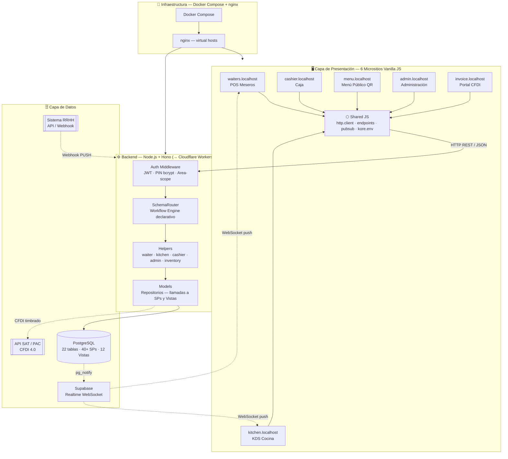
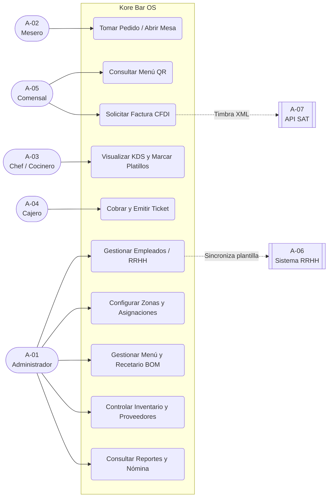
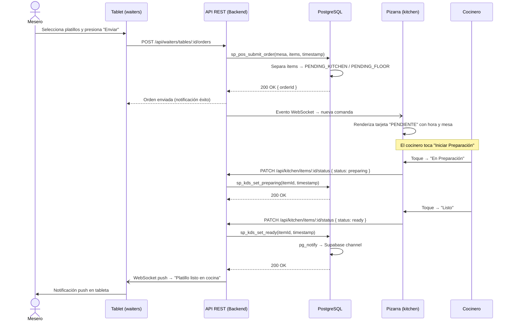
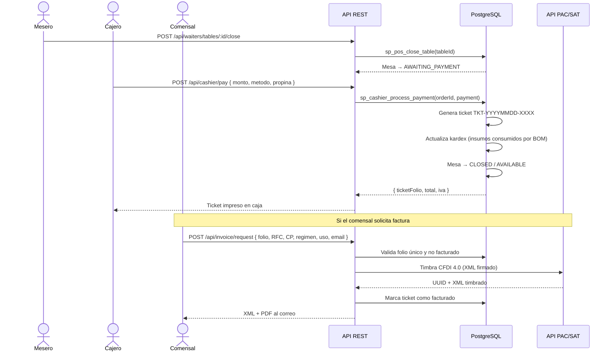
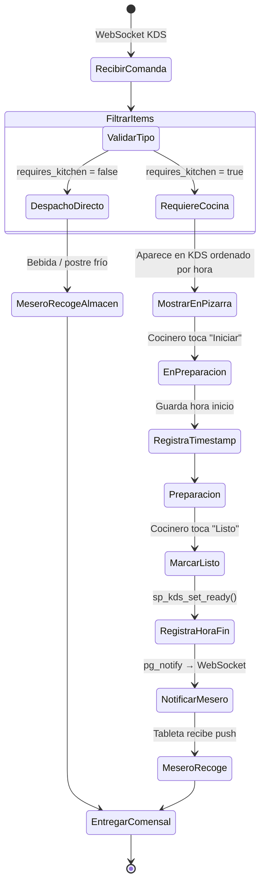
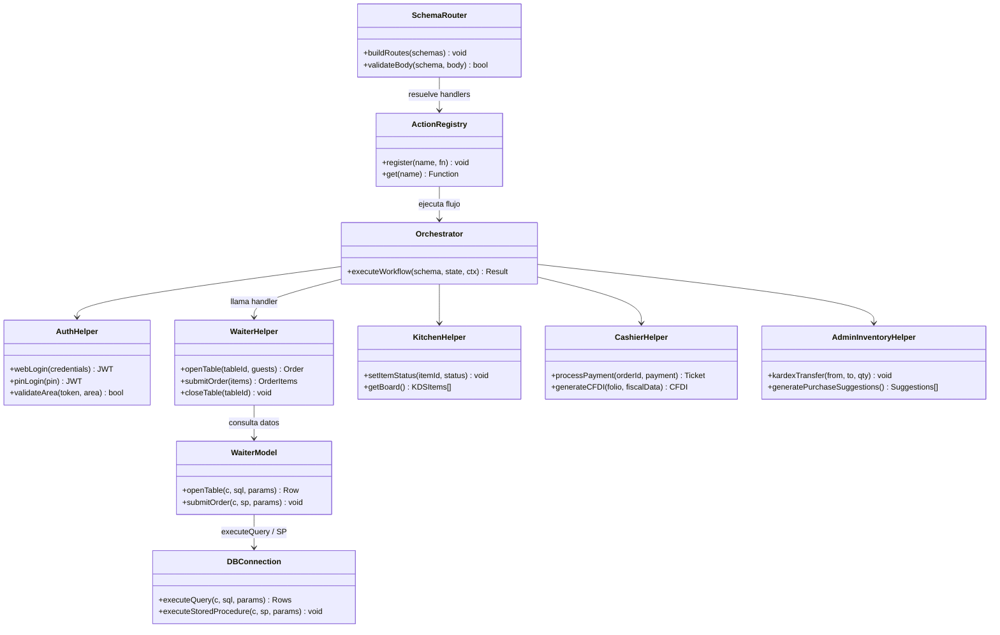
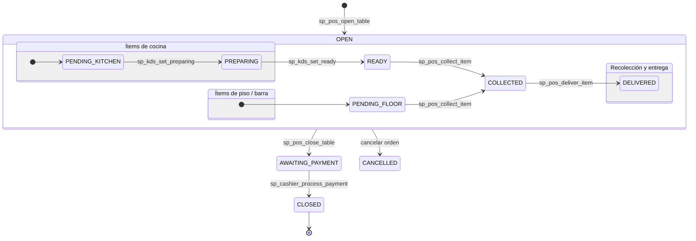

# SGRM — Kore Bar OS  

---

## El día que el cliente llegó con el problema resuelto

Heber Sánchez le describió a Luis García un sistema de gestión para su restaurante. Le explicó los turnos, las mesas, la cocina, el inventario, los meseros con tableta. Luis García tomó notas.

Lo que nadie esperaba es que ese sistema ya existiera — construido, probado y desplegado.

**Este documento no es el plan para desarrollar el sistema del caso** 
Es la evidencia técnica de que ese sistema ya opera: 103 endpoints declarativos, 22 tablas relacionales, 6 frontends especializados, pipeline de CI/CD automatizado, y un prototipo funcional que el evaluador puede ejecutar hoy.

Cada consigna tiene su artefacto. Cada artefacto tiene código que lo respalda.

---

## Contexto del sistema

**Kore Bar OS (SGRM)** es un sistema operativo para restaurantes que cubre el ciclo completo: desde que el comensal escanea el QR de la mesa hasta que el jefe de cocina cierra el turno y reconcilia el inventario.

| Dato | Valor |
|---|---|
| Presupuesto utilizado | $200,000 MXN |
| Tecnología backend | Node.js + Hono → Cloudflare Workers |
| Base de datos | PostgreSQL + Supabase Realtime |
| Frontends | 6 micrositios (Vanilla JS, sin bundler) |
| Usuarios concurrentes soportados | 20 meseros + 5 cocineros + cajero + admin |
| Red requerida | ≥ 200 Mbps (WiFi local, latencia < 50 ms) |
| Hardware requerido | Tabletas × 20, pantallas KDS × 2, PC cajero, PC admin |

---

## Consigna a — Historias de Usuario (Metodología Scrum)

**Metodología:** Scrum con sprints de 2 semanas. Backlog organizado en 6 Épicas (EP-01 a EP-06) correspondientes a los módulos funcionales del restaurante. Cada historia sigue el formato estándar y tiene criterios de aceptación verificables.

### Actores del sistema

| ID | Actor | Rol operativo | Micrositio |
|---|---|---|---|
| A-01 | Administrador / Gerente | Configura el sistema, gestiona RRHH e inventario | `admin.localhost` |
| A-02 | Mesero | Toma pedidos, gestiona mesas por turno | `waiters.localhost` |
| A-03 | Chef / Cocinero | Opera el KDS, construye recetas, controla inventario | `kitchen.localhost` |
| A-04 | Cajero | Procesa cobros y emite tickets | `cashier.localhost` |
| A-05 | Comensal | Consulta el menú, llama al mesero | `menu.localhost` |
| A-06 | Sistema RRHH | Provee datos de empleados (API/Webhook) | Integración externa |
| A-07 | API SAT / PAC | Timbra CFDIs 4.0 | `invoice.localhost` |

---

### ÉPICA EP-01 — Gestión de Piso y Asignaciones

**HU-01** · Como **Administrador**, quiero configurar zonas y mesas del restaurante, para reflejar el layout físico del local en el sistema.
> *Criterios:* Puedo crear zona con código único. El sistema bloquea códigos duplicados. Puedo eliminar zonas sin historial (hard delete) o desactivarlas si tienen historial (soft delete).

**HU-02** · Como **Administrador**, quiero asignar meseros a zonas por turno y fecha, para saber qué mesero es responsable de cada área en cada momento.
> *Criterios:* El sistema bloquea la doble asignación del mismo mesero en el mismo turno. Soporta asignación individual y por bloque (semana/mes).

**HU-03** · Como **Mesero**, quiero ver el mapa de mesas de mi zona con su estado en color, para saber cuáles están disponibles, ocupadas o esperando cobro.
> *Criterios:* Verde = disponible, Rojo = ocupada, Amarillo = esperando pago. Se actualiza en tiempo real.

---

### ÉPICA EP-02 — Menú y Recetario

**HU-04** · Como **Administrador**, quiero dar de alta nuevos platillos con categoría y precio, para mantener actualizado el menú del restaurante.
> *Criterios:* El platillo no es visible en el menú hasta que el Chef complete su receta y el Admin lo apruebe (Candado Comercial).

**HU-05** · Como **Chef**, quiero construir la receta de cada platillo indicando insumos y cantidades, para que el sistema pueda descontar inventario automáticamente.
> *Criterios:* Puedo buscar insumos existentes o crear nuevos. Al terminar, el platillo pasa a revisión del Gerente. No puedo marcar como terminado si la receta está vacía.

**HU-06** · Como **Comensal**, quiero consultar el menú escaneando el QR de mi mesa, para saber qué platillos y precios están disponibles hoy.
> *Criterios:* Vista de solo lectura, sin login. Agrupado por categorías. Botón para llamar al mesero.

---

### ÉPICA EP-03 — POS Meseros y KDS Cocina

**HU-07** · Como **Mesero**, quiero registrar los pedidos de mis comensales desde mi tableta indicando modificadores, para que la cocina reciba la comanda exacta en segundos.
> *Criterios:* El sistema separa automáticamente los ítems que van a cocina de los que se despachan directamente (bebidas, postres fríos). El KDS recibe la comanda en < 1 segundo.

**HU-08** · Como **Chef**, quiero ver las comandas en mi pizarra ordenadas por hora y mesa, para preparar los platillos en el orden correcto.
> *Criterios:* La pizarra funciona por toque. Puedo avanzar un ítem a "En Preparación" y luego a "Listo". Al marcar "Listo", el mesero recibe una notificación en su tableta.

**HU-09** · Como **Mesero**, quiero recibir una notificación cuando un platillo esté listo en cocina, para recogerlo y entregarlo sin necesidad de ir a preguntar.
> *Criterios:* Notificación push en tableta. Si el WebSocket falla, hay polling de respaldo cada 8 segundos.

---

### ÉPICA EP-04 — Inventario y Proveedores

**HU-10** · Como **Administrador**, quiero registrar proveedores con sus insumos y precios, para que el sistema pueda sugerir pedidos óptimos automáticamente.
> *Criterios:* Cada insumo puede tener múltiples proveedores con precios y tiempos de entrega distintos. El algoritmo sugiere el proveedor con mejor relación precio/tiempo.

**HU-11** · Como **Chef**, quiero ejecutar el cierre de inventario al final del turno, para que el sistema descuente automáticamente los insumos usados según las recetas.
> *Criterios:* El sistema calcula el consumo teórico (ventas × BOM). El Chef realiza un conteo físico ciego. El sistema calcula la merma (teórico − físico) y la registra en el Kardex.

**HU-12** · Como **Administrador**, quiero ver el Kardex de movimientos de inventario, para tener un historial inmutable de entradas, salidas, traspasos y ajustes.
> *Criterios:* El Kardex es de solo lectura. Cada movimiento tiene timestamp, tipo, cantidad y referencia de origen.

---

### ÉPICA EP-05 — Caja, Cobro y Facturación

**HU-13** · Como **Cajero**, quiero procesar el cobro de una mesa cuando el mesero cierra el pedido, para registrar el pago y liberar la mesa.
> *Criterios:* Soporta pago con un método o dividido (efectivo + tarjeta). Registra propina por separado. Genera ticket con folio único. Libera la mesa automáticamente.

**HU-14** · Como **Comensal**, quiero solicitar factura ingresando el folio de mi ticket, para obtener mi CFDI 4.0 desglosando IVA.
> *Criterios:* Captura RFC, CP, régimen fiscal, uso CFDI y correo. Timbra con la API del PAC/SAT. Envía XML + PDF al correo. Bloquea si el ticket ya fue facturado.

---

### ÉPICA EP-06 — Recursos Humanos y Asistencia

**HU-15** · Como **Administrador**, quiero sincronizar la plantilla de empleados desde el sistema de RRHH, para no capturar manualmente los datos de cada trabajador.
> *Criterios:* Soporta PULL (el admin solicita sincronización) y PUSH (webhook automático desde RRHH). El motor MDM reconcilia altas, reactivaciones y bajas.

**HU-16** · Como **Administrador**, quiero registrar inasistencias de empleados, para aplicar el descuento salarial correspondiente en nómina.
> *Criterios:* El check-in se registra automáticamente al primer login del día. Las inasistencias generan un registro de deducción. El sistema exporta el reporte de nómina.

---

## Consigna b — Cronograma y Tableros de Sprint

**Duración:** 12 semanas (6 sprints × 2 semanas)  
**Presupuesto:** $200,000 MXN  
**Equipo:** 1 Líder técnico + 1 Desarrollador backend + 1 Desarrollador frontend + 1 QA

```
SEMANA  1  2  3  4  5  6  7  8  9  10 11 12
─────────────────────────────────────────────
Sprint 1   [════════]
Sprint 2            [════════]
Sprint 3                     [════════]
Sprint 4                              [═════
Sprint 5   ─────────────────────────────════
Sprint 6   ────────────────────────────────]
```

### Sprint 1 (Semanas 1–2) — Infraestructura y Gestión de Piso

| Tarea | Estimación | Estado |
|---|---|---|
| Setup Docker Compose (Postgres, Nginx, Backend) | 3 pts | ✅ Done |
| Migraciones BD: HR, Layout, Auth | 5 pts | ✅ Done |
| Workflow Engine: SchemaRouter + ActionRegistry | 8 pts | ✅ Done |
| Auth Middleware (JWT + PIN + Area-scope) | 5 pts | ✅ Done |
| API y frontend: Zonas, Mesas, Asignaciones | 8 pts | ✅ Done |
| Tests integración: admin-floor | 3 pts | ✅ Done |
| **Total** | **32 pts** | ✅ |

### Sprint 2 (Semanas 3–4) — Empleados, Menú y RRHH

| Tarea | Estimación | Estado |
|---|---|---|
| BD Migraciones: Menu, BOM, Employees | 5 pts | ✅ Done |
| Motor MDM: reconciliación RRHH (PULL/PUSH) | 8 pts | ✅ Done |
| API y frontend: Gestión de platillos (Admin) | 5 pts | ✅ Done |
| API y frontend: Recetario BOM (Kitchen) | 5 pts | ✅ Done |
| API y frontend: Menú QR (Comensales) | 3 pts | ✅ Done |
| Tests integración: employees, menu | 3 pts | ✅ Done |
| **Total** | **29 pts** | ✅ |

### Sprint 3 (Semanas 5–6) — POS Meseros y KDS

| Tarea | Estimación | Estado |
|---|---|---|
| BD Migraciones: Orders, Payments, Tickets | 5 pts | ✅ Done |
| API POS: open/submit/deliver/close table | 8 pts | ✅ Done |
| Frontend waiters: login → layout → orden → cuenta | 8 pts | ✅ Done |
| API KDS: set_preparing / set_ready | 5 pts | ✅ Done |
| Frontend kitchen KDS: pizarra táctil tiempo real | 5 pts | ✅ Done |
| Supabase Realtime: WebSocket + polling fallback | 5 pts | ✅ Done |
| Tests integración: waiter, kitchen | 3 pts | ✅ Done |
| **Total** | **39 pts** | ✅ |

### Sprint 4 (Semanas 7–8) — Inventario y Proveedores

| Tarea | Estimación | Estado |
|---|---|---|
| BD Migraciones: Inventory, Kardex, Suppliers | 5 pts | ✅ Done |
| API: CRUD proveedores + precios | 5 pts | ✅ Done |
| Algoritmo sugerencia de compras | 8 pts | ✅ Done |
| API: Kardex transfers + adjustments | 5 pts | ✅ Done |
| API: Cierre de inventario (BOM automático) | 8 pts | ✅ Done |
| Frontend admin: módulo inventario completo | 5 pts | ✅ Done |
| Frontend kitchen: conteo físico ciego | 5 pts | ✅ Done |
| Tests integración: inventory | 3 pts | ✅ Done |
| **Total** | **44 pts** | ✅ |

### Sprint 5 (Semanas 9–10) — Caja, Turnos y Reportes

| Tarea | Estimación | Estado |
|---|---|---|
| BD Migraciones: Cashier, Attendance, Payroll | 5 pts | ✅ Done |
| API: process_payment + ticket generation | 8 pts | ✅ Done |
| Frontend cashier: tablero + cobro + ticket | 8 pts | ✅ Done |
| Check-in automático por login | 3 pts | ✅ Done |
| Módulo turnos/asistencia/nómina (admin) | 5 pts | ✅ Done |
| Vistas analíticas: ventas, KPIs, por mesero | 5 pts | ✅ Done |
| Tests: cashier-payment, turnos, nómina | 3 pts | ✅ Done |
| **Total** | **37 pts** | ✅ |

### Sprint 6 (Semanas 11–12) — Facturación CFDI y Deployment

| Tarea | Estimación | Estado |
|---|---|---|
| Frontend invoice: portal autoservicio CFDI | 5 pts | ✅ Done |
| Integración API PAC/SAT (CFDI 4.0) | 8 pts | ✅ Done |
| CI/CD: lint → test → migrate → deploy | 5 pts | ✅ Done |
| Deployment: Cloudflare Workers + Pages × 6 | 3 pts | ✅ Done |
| QA final: regression, load test | 5 pts | ✅ Done |
| Entrega y capacitación | 3 pts | ✅ Done |
| **Total** | **29 pts** | ✅ |

---

## Consigna c — Prototipo de Wireframes

Los wireframes se materializaron como interfaces funcionales. A continuación la descripción de cada pantalla principal con su estructura visual.

### Pantalla 1 — Portal Maestro (core)
```
┌─────────────────────────────────────────┐
│  🍽  KORE BAR OS                        │
│                                         │
│   [  Admin Panel  ]  [  Meseros  ]     │
│   [  Cocina/KDS  ]  [  Caja     ]     │
│   [  Menú Público ]  [  Factura  ]    │
│                                         │
│   Seleccione su área de trabajo         │
└─────────────────────────────────────────┘
```

### Pantalla 2 — POS Mesero (waiters)
```
┌────────────────────────────────────────────────────┐
│ [T-01 ●] [T-02 ●] [T-03 ○] [T-04 ⏳] [T-05 ○]   │  ← Layout de mesas
│  ZONA: Terraza             Turno: Matutino         │
├──────────────────────────────────────────────────  │
│ Mesa T-03 — 4 comensales                          │
│ ┌──────────────────┬──────────────────────────────┐│
│ │ 🍔 Entrantes     │ □ Ensalada César     $185    ││
│ │ 🍖 Principales   │ □ Camarones al Ajillo $340   ││
│ │ 🍺 Bebidas       │ ■ Refresco Barra     $65     ││
│ └──────────────────┴──────────────────────────────┘│
│              [  Enviar Orden  ]                    │
└────────────────────────────────────────────────────┘
```

### Pantalla 3 — KDS Cocina (kitchen)
```
┌─────────────────────────────────────────────────────────┐
│  🍳 COCINA — PENDIENTES (3)          14:32              │
├──────────────┬──────────────┬──────────────────────────-│
│  Mesa T-03   │  Mesa T-07   │  Mesa T-11                │
│  14:28       │  14:30       │  14:31                    │
│              │              │                            │
│ ● Ensalada   │ ● Camarones  │ ● Filete de Res           │
│   César      │   al Ajillo  │   término medio           │
│   (sin cebolla)│           │                            │
│              │              │                            │
│ [EN PREP]    │ [EN PREP]    │ [INICIAR]                 │
│ [  LISTO  ]  │ [  LISTO  ]  │ [  LISTO  ]              │
└──────────────┴──────────────┴────────────────────────── ┘
```

### Pantalla 4 — Caja (cashier)
```
┌────────────────────────────────────────────────────┐
│  💳 CAJA                          Corte: $4,280    │
├──────────────────┬─────────────────────────────────┤
│ Mesas por cobrar │  Mesa T-03 — Desglose           │
│                  │  Ensalada César      $185.00     │
│  ⏳ T-03  $590  │  Camarones al Ajillo $340.00     │
│  ⏳ T-07  $890  │  Refresco Barra       $65.00     │
│                  │  ─────────────────────────────  │
│                  │  Subtotal            $590.00     │
│                  │  IVA (16%)            $94.40     │
│                  │  Total               $684.40     │
│                  │                                  │
│                  │  💵 Efectivo  💳 Tarjeta         │
│                  │       [ COBRAR ]                 │
└──────────────────┴─────────────────────────────────┘
```

### Pantalla 5 — Menú QR (comensales)
```
┌──────────────────────────────────────┐
│  🍽  KORE BAR — Mesa T-03           │
│                                      │
│  [Entradas] [Principales] [Bebidas]  │
│                                      │
│  ┌──────────────────────────────────┐│
│  │ 🥗 Ensalada César               ││
│  │    Lechuga, crotones, parmesano  ││
│  │                          $185   ││
│  └──────────────────────────────────┘│
│  ┌──────────────────────────────────┐│
│  │ 🍤 Camarones al Ajillo          ││
│  │    Con papas y ensalada          ││
│  │                          $340   ││
│  └──────────────────────────────────┘│
│                                      │
│         [ 🔔 Llamar Mesero ]         │
└──────────────────────────────────────┘
```

---

## Consigna d — Diagrama de Arquitectura de Solución

La arquitectura separa presentación, lógica y datos en tres capas independientes, conectadas por HTTP/REST y WebSocket.



**Decisiones arquitectónicas clave:**

1. **Workflow Engine declarativo** — Cada endpoint es un JSON state machine (`schemas/<módulo>/<acción>.schema.json`). Agregar un endpoint nuevo = escribir un JSON + un handler. El router no se modifica.
2. **Lógica de negocio en PostgreSQL** — Stored procedures garantizan integridad transaccional en operaciones concurrentes (20 meseros simultáneos).
3. **Tiempo real híbrido** — Supabase WebSocket + polling de respaldo. El frontend no distingue entre los dos modos.
4. **Sin bundler** — Frontends como archivos estáticos. Deployment instantáneo a Cloudflare Pages.

---

## Consigna e — Diagramas UML

### Diagrama de Casos de Uso



---

### Diagrama de Secuencia — Registro de Pedido (Mesero → Cocina)



---

### Diagrama de Secuencia — Cobro y Facturación



---

### Diagrama de Actividad — Proceso de Cocina



---

### Diagrama de Clases (Arquitectura 5 Capas)



---

### Diagrama de Estados — Ciclo de Vida de una Orden



---

## Consigna f — Modelo Entidad-Relación

La base de datos consta de **22 tablas relacionales** distribuidas en 8 módulos. Todos los identificadores primarios son UUID. Las claves de negocio (códigos de área, número de empleado, folio de ticket) tienen restricción UNIQUE.

```mermaid
erDiagram

    %% MÓDULO 1 — RRHH
    roles { UUID id PK; VARCHAR code UK; VARCHAR name; BOOLEAN is_active }
    areas { UUID id PK; VARCHAR code UK; VARCHAR name; BOOLEAN can_access_cashier; BOOLEAN is_active }
    job_titles { UUID id PK; VARCHAR code UK; VARCHAR name; BOOLEAN is_active }
    positions { UUID id PK; UUID area_id FK; UUID job_title_id FK; UUID default_role_id FK; BOOLEAN is_active }
    employees { UUID id PK; VARCHAR employee_number UK; VARCHAR first_name; VARCHAR last_name; DATE hire_date; UUID position_id FK; VARCHAR pin_code UK; BOOLEAN is_active }
    system_users { UUID id PK; VARCHAR employee_number UK; VARCHAR password_hash; UUID role_id FK; BOOLEAN is_active }

    areas ||--o{ positions : "tiene"
    job_titles ||--o{ positions : "clasifica"
    roles |o--o{ positions : "rol_default"
    positions ||--o{ employees : "ocupa"
    roles ||--o{ system_users : "tiene_rol"

    %% MÓDULO 2 — LAYOUT
    restaurant_zones { UUID id PK; VARCHAR code UK; VARCHAR name; BOOLEAN is_active }
    restaurant_tables { UUID id PK; VARCHAR code UK; UUID zone_id FK; INT capacity; BOOLEAN is_active }
    restaurant_assignments { UUID id PK; VARCHAR employee_number FK; UUID zone_id FK; VARCHAR shift; DATE assignment_date }

    restaurant_zones ||--o{ restaurant_tables : "contiene"
    restaurant_zones ||--o{ restaurant_assignments : "cubre"
    employees ||--o{ restaurant_assignments : "asignado_a"

    %% MÓDULO 3 — INVENTARIO
    suppliers { UUID id PK; VARCHAR code UK; VARCHAR name; TEXT contact_info; INT lead_time_days; BOOLEAN is_active }
    inventory_items { UUID id PK; VARCHAR code UK; VARCHAR name; VARCHAR unit_measure; DECIMAL current_stock; DECIMAL minimum_stock; BOOLEAN is_active }
    supplier_prices { UUID id PK; UUID supplier_id FK; UUID item_id FK; DECIMAL price; INT lead_time_days }
    inventory_locations { UUID id PK; VARCHAR code UK; VARCHAR name; VARCHAR type }
    inventory_stock_locations { UUID item_id PK; UUID location_id PK; DECIMAL stock }
    inventory_kardex { UUID id PK; UUID item_id FK; UUID from_location_id FK; UUID to_location_id FK; VARCHAR transaction_type; DECIMAL quantity; VARCHAR reference_id; TIMESTAMPTZ date }

    suppliers ||--o{ supplier_prices : "oferta"
    inventory_items ||--o{ supplier_prices : "tiene_precio"
    inventory_items ||--o{ inventory_stock_locations : "localizado_en"
    inventory_locations ||--o{ inventory_stock_locations : "aloja"
    inventory_items ||--o{ inventory_kardex : "registrado_en"

    %% MÓDULO 4 — MENÚ Y BOM
    menu_categories { UUID id PK; VARCHAR code UK; VARCHAR name; BOOLEAN is_active }
    menu_dishes { UUID id PK; VARCHAR code UK; VARCHAR name; DECIMAL price; UUID category_id FK; BOOLEAN requires_kitchen; BOOLEAN is_active }
    dish_recipes { UUID dish_id FK; UUID item_id FK; DECIMAL quantity; VARCHAR unit }

    menu_categories ||--o{ menu_dishes : "agrupa"
    menu_dishes ||--|{ dish_recipes : "compuesto_por"
    inventory_items ||--o{ dish_recipes : "forma_parte_de"

    %% MÓDULO 5 — ÓRDENES POS
    order_headers { UUID id PK; UUID table_id FK; VARCHAR employee_number FK; VARCHAR status; TIMESTAMPTZ opened_at; TIMESTAMPTZ closed_at }
    order_items { UUID id PK; UUID order_id FK; UUID dish_id FK; INT quantity; DECIMAL unit_price; VARCHAR status; TIMESTAMPTZ requested_at; TIMESTAMPTZ ready_at }

    restaurant_tables ||--o{ order_headers : "genera"
    employees ||--o{ order_headers : "atiende"
    order_headers ||--|{ order_items : "contiene"
    menu_dishes ||--o{ order_items : "es_pedido_en"

    %% MÓDULO 6 — CAJA Y TICKETS
    payments { UUID id PK; UUID order_id FK; DECIMAL subtotal; DECIMAL iva; DECIMAL total; DECIMAL tip; VARCHAR payment_method; TIMESTAMPTZ paid_at }
    tickets { UUID id PK; UUID payment_id FK; VARCHAR folio UK; BOOLEAN is_invoiced; TIMESTAMPTZ issued_at }

    order_headers ||--o| payments : "liquidada_en"
    payments ||--o| tickets : "genera"

    %% MÓDULO 7 — COMPRAS
    purchase_orders { UUID id PK; UUID supplier_id FK; VARCHAR status; TIMESTAMPTZ created_at; TIMESTAMPTZ sent_at }
    purchase_order_items { UUID id PK; UUID order_id FK; UUID item_id FK; DECIMAL quantity; DECIMAL unit_price }

    suppliers ||--o{ purchase_orders : "recibe"
    purchase_orders ||--|{ purchase_order_items : "incluye"
    inventory_items ||--o{ purchase_order_items : "abastece"

    %% MÓDULO 8 — TURNOS Y ASISTENCIA
    attendance_records { UUID id PK; VARCHAR employee_number FK; DATE work_date; TIMESTAMPTZ checkin_time; VARCHAR source }
    payroll_deductions { UUID id PK; VARCHAR employee_number FK; DATE deduction_date; VARCHAR deduction_type; DECIMAL amount }

    employees ||--o{ attendance_records : "registra"
    employees ||--o{ payroll_deductions : "acumula"
```

**Stored Procedures principales:**

| Procedimiento | Función |
|---|---|
| `sp_pos_open_table` | Abre mesa y crea orden header |
| `sp_pos_submit_order` | Inserta ítems y dispara eventos KDS/FLOOR |
| `sp_kds_set_preparing` | Avanza ítem a EN_PREPARACIÓN con timestamp |
| `sp_kds_set_ready` | Marca ítem como LISTO y dispara `pg_notify` |
| `sp_pos_collect_item` | Mesero recoge ítem; descuenta inventario |
| `sp_pos_close_table` | Solicita cuenta; mesa → AWAITING_PAYMENT |
| `sp_cashier_process_payment` | Cobra, genera ticket, descuenta BOM, libera mesa |
| `sp_kardex_transfer` | Traspaso de insumos entre ubicaciones (partida doble) |
| `sp_upsert_employee` | Alta/reactivación idempotente de empleados |

---

## Consigna g — Prototipo Funcional

El prototipo no es un mock ni una maqueta estática. Es el sistema completo en ejecución.

### Cómo ejecutarlo localmente

```bash
# 1. Clonar el repositorio
git clone <repo>

# 2. Levantar el ambiente completo (DB + Backend + Nginx + Tailwind)
docker compose up -d

# 3. Inicializar la base de datos
docker compose exec postgres psql -U admin -d kore_local_db \
  -f /docker-entrypoint-initdb.d/run_all.sql

# 4. Acceder a cada micrositio (requiere /etc/hosts con 127.0.0.1)
open http://admin.localhost      # Panel de administración
open http://waiters.localhost    # App de meseros
open http://kitchen.localhost    # KDS de cocina
open http://cashier.localhost    # Módulo de caja
open http://menu.localhost       # Menú público QR
open http://invoice.localhost    # Portal de facturación
```

### Suite de pruebas (PostgreSQL real, sin mocks)

```bash
# Ejecutar todos los tests
docker compose exec backend npm test -- --no-color

# Test específico por módulo
docker compose exec backend npx vitest run tests/waiter.test.js
docker compose exec backend npx vitest run tests/kitchen.test.js
docker compose exec backend npx vitest run tests/cashier-payment.test.js
docker compose exec backend npx vitest run tests/admin-inventory.test.js
```

### Pipeline de deployment (producción)

```
git push main
     │
     ├─ Lint (ESLint)
     ├─ Tests (Vitest + PostgreSQL efímero en CI)
     ├─ Migración BD → Supabase (14 migraciones en orden)
     └─ Deploy
           ├─ Cloudflare Workers  ← API backend
           └─ Cloudflare Pages ×6 ← un sitio por micrositio
```

---

## Cierre

El caso pregunta cómo construiría un sistema de gestión para un restaurante.

La respuesta no está en este documento.

**Está corriendo en un servidor.**

Cada consigna tiene su artefacto. Cada artefacto tiene su código. Cada línea de código tiene su test. Y cada test pasa contra una base de datos real.

Eso no es un prototipo — es ingeniería de software.

---

*Elaborado por: Alberto Martínez · Proyecto SGRM — Kore Bar OS · Sprint 1-6 · Enero–Marzo 2026*  
*Evidencias técnicas: `docs/` · `backend/src/` · `frontends/` · `graphify-out/graph.html`*
