# HU-04 — Diagrama de Clases: Kore Bar OS
**Evidencia Sprint 1 · Análisis y Diseño · Marzo 2026**

> El sistema sigue una arquitectura de **5 capas** estrictas.
> Cada diagrama cubre un dominio funcional completo mostrando
> las relaciones entre clases a través de las capas.
>
> **Convenciones de notación:**
> `+` público · `-` privado · `#` protegido
> `-->` asociación · `..>` dependencia/uso · `<|--` herencia · `*--` composición

---

## 1. Arquitectura General de Capas

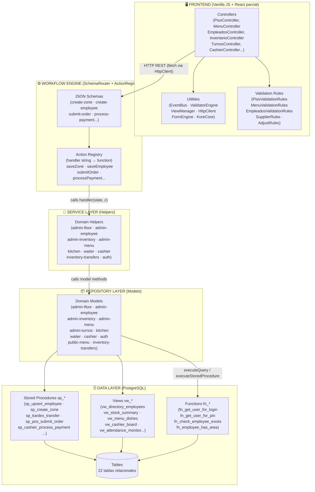

---

## 2. Capa de Conexión a Base de Datos (Shared)

> Todas las clases del Repositorio (Models) dependen de esta capa.

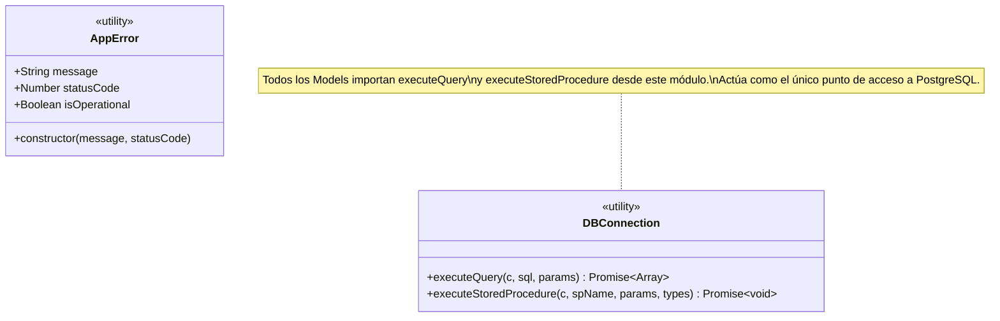

---

## 3. Dominio RRHH y Autenticación

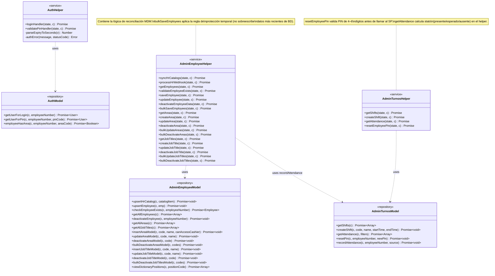

---

## 4. Dominio Gestión de Piso (Layout)

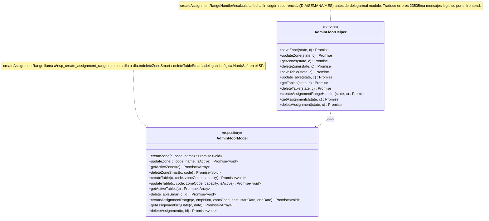

---

## 5. Dominio Inventario y Proveedores

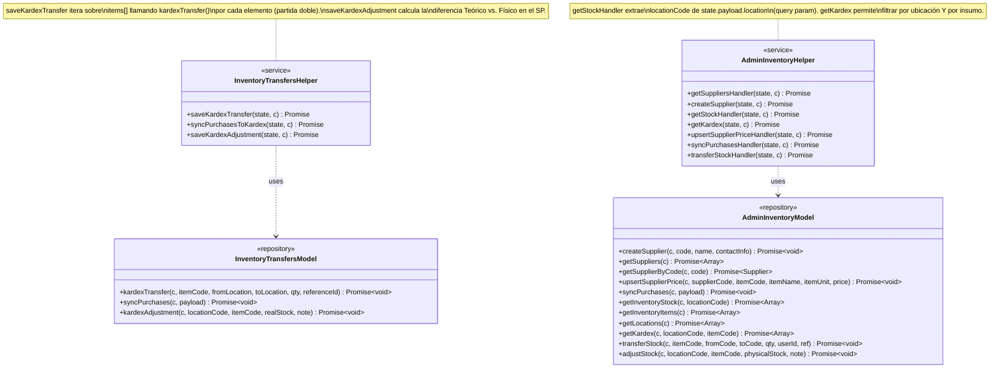

---

## 6. Dominio Menú y Cocina

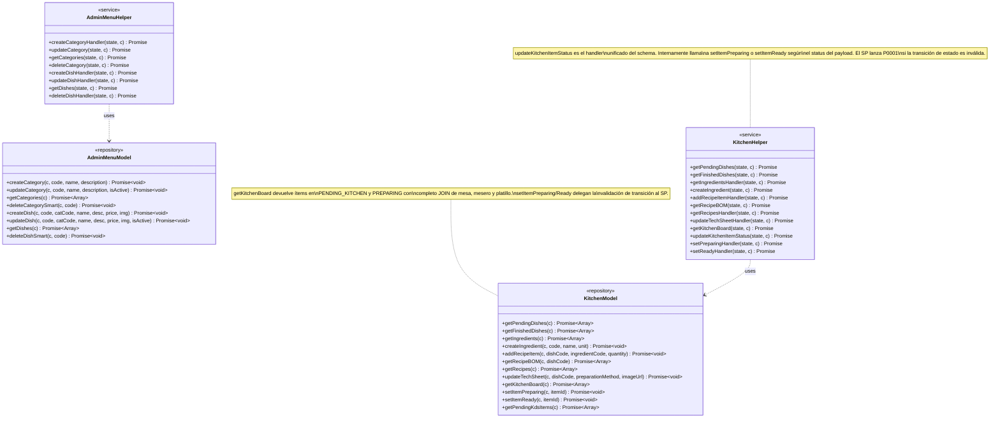

---

## 7. Dominio POS — Meseros y Caja

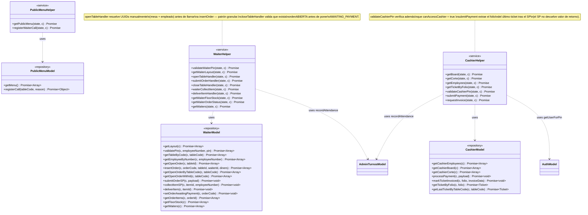

---

## 8. Motor de Workflow — Patrón Schema-Driven

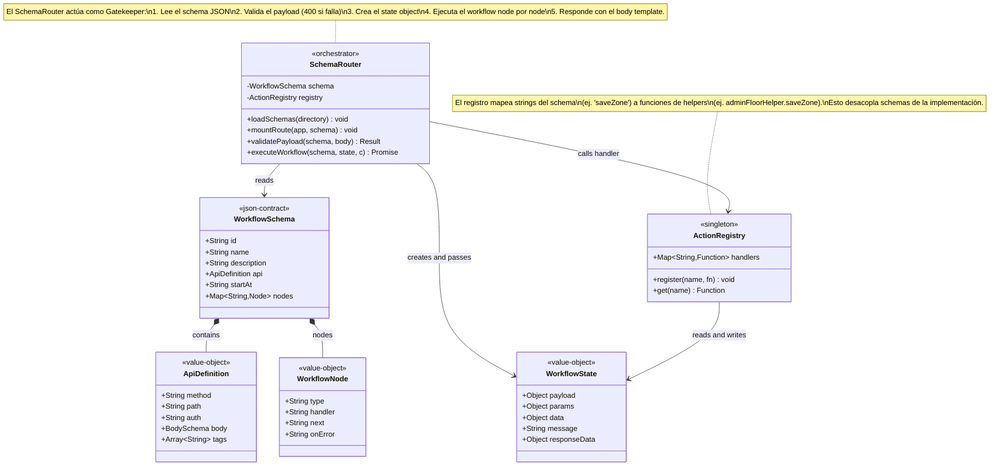

---

## 9. Diagrama de Secuencia del Workflow Engine

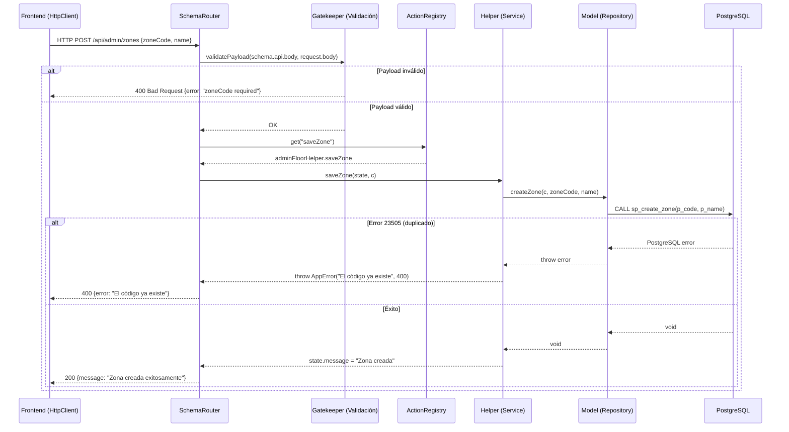

---

## 10. Frontend — Utilidades Compartidas

```mermaid
classDiagram
    direction TB

    class EventBus {
        <<singleton PubSub>>
        -Map~String,Array~ events
        +subscribe(event, callback) Function
        +publish(event, data) void
    }

    class ValidatorEngine {
        -RulesConfig config
        +constructor(rulesConfig)
        +execute(payload, state) ValidationResult
    }

    class ValidationResult {
        <<value-object>>
        +Boolean isValid
        +String error
        +Array logs
    }

    class ViewManager {
        <<singleton>>
        -HTMLElement root
        +constructor(rootSelector)
        +mount(templateId) HTMLElement
    }

    class TemplateLoader {
        <<static utility>>
        +loadPartials(partialsList, basePath) Promise~void~
    }

    class HttpClient {
        <<static utility>>
        -buildUrl(endpointRaw, params) String
        +fetchData(endpoint, params) Promise
        +postData(endpoint, data, params) Promise
        +putData(endpoint, data, params) Promise
        +deleteData(endpoint, params) Promise
    }

    class FormEngine {
        <<static utility>>
        +bindForm(formId, submitCallback) void
        -applyPostSubmitRules(formId, form) void
    }

    class KoreCore {
        <<singleton>>
        +setupLogger() void
        +boot() void
        +renderOffline(host) void
    }

    class KoreConfig {
        <<configuration>>
        +String BASE_DOMAIN
        +String ENV
        +Boolean DEBUG
        +Object API
        +Object SITES
        +Object DOM
    }

    class UIRules {
        <<static config>>
        +Map~String,Object~ rules
    }

    ValidatorEngine --> ValidationResult : returns
    FormEngine ..> UIRules : reads preserveFields
    HttpClient ..> KoreConfig : reads API.BASE_URL
    KoreCore ..> KoreConfig : reads SITES and DOM
    FormEngine ..> UIModule : calls showErrorModal

    note for EventBus "Bus de eventos síncrono en memoria.\nSubscribe devuelve función de\ndesubscripción. Los eventos mueren\nal hacer viewManager.mount() (nuevo innerHTML)."

    note for HttpClient "buildUrl reemplaza tokens :param\nde forma automática. Todos los\ncontroladores usan ENDPOINTS constants\n— PROHIBIDO hacer fetch() directo."
```

---

## 11. Frontend — Utilidades de UI

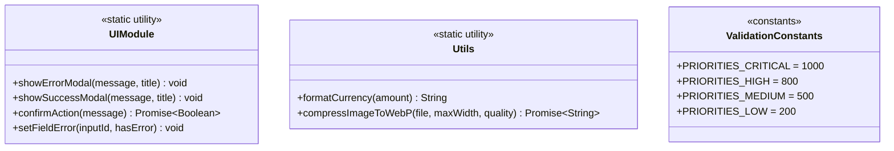

---

## 12. Frontend — Reglas de Validación

```mermaid
classDiagram
    direction TB

    class ValidatorEngine {
        -RulesConfig config
        +execute(payload, state) ValidationResult
    }

    class PisoValidationRules {
        <<rules-config>>
        +String context = "GestionPiso"
        +Array order
        +formatoMesa(payload) Result
        +mesaDuplicada(payload, state) Result
        +fechaPasada(payload) Result
        +colisionTurnos(payload, state) Result
    }

    class MenuValidationRules {
        <<rules-config>>
        +String context = "GestionMenu"
        +Array order
        +formatoCodigo(payload) Result
        +precioPlatillo(payload) Result
        +codigoDuplicado(payload, state) Result
    }

    class EmpleadosValidationRules {
        <<rules-config>>
        +String context = "GestionEmpleados"
        +Array order
        +urlSyncValida(payload) Result
        +integridadDatosHR(payload) Result
        +datosEdicionCompletos(payload) Result
    }

    class SupplierRules {
        <<rules-config>>
        +String context = "Alta de Proveedores"
        +code(payload) Result
        +name(payload) Result
    }

    class AdjustRules {
        <<rules-config>>
        +String context = "Ajuste de Inventario"
        +transactionType(payload) Result
        +quantity(payload) Result
        +reference(payload) Result
    }

    class SupplierPriceRules {
        <<rules-config>>
        +String context = "Vinculación de Costo"
        +itemCode(payload) Result
        +itemName(payload) Result
        +price(payload) Result
    }

    ValidatorEngine --> PisoValidationRules : configured with
    ValidatorEngine --> MenuValidationRules : configured with
    ValidatorEngine --> EmpleadosValidationRules : configured with
    ValidatorEngine --> SupplierRules : configured with
    ValidatorEngine --> AdjustRules : configured with
    ValidatorEngine --> SupplierPriceRules : configured with

    note for PisoValidationRules "colisionTurnos: verifica contra\nassignments[] en memoria\nANTES del HTTP — respuesta instantánea.\nfechaPasada: compara con new Date()\nnormalizado a 00:00 local."

    note for EmpleadosValidationRules "integridadDatosHR filtra los\nregistros EMP-06 (sin ID o sin nombre)\nantes de que lleguen al MDMEngine.\nEsto protege el ciclo de reconciliación."
```

---

## 13. Frontend — Controladores Admin

```mermaid
classDiagram
    direction TB

    class SidebarController {
        <<controller>>
        -Dom _dom
        +mount(container) void
        -_cacheDOM(container) void
        -_bindEvents() void
        -_render_setActiveState(viewName) void
    }

    class DashboardController {
        <<controller>>
        +mount(container) Promise~void~
        -_cacheDOM(container) void
        -_bindEvents() void
        -_logic_loadData() Promise~void~
    }

    class PisoController {
        <<orchestrator>>
        +mount(container) Promise~void~
        -_iniciarReloj(container) void
    }

    class ZonasController {
        <<controller>>
        +mount(container) Promise~void~
        +getZonas() Array
        -logic_cargarDatos() Promise~void~
        -logic_crearZona() Promise~void~
        -logic_eliminarZona(code, name) Promise~void~
        -render_lista() void
        -render_cacheDOM(container) void
    }

    class MesasController {
        <<controller>>
        +mount(container) Promise~void~
        +actualizarZonas(zonas) void
        -logic_cargarMesas() Promise~void~
        -logic_crearMesa() Promise~void~
        -logic_eliminarMesa(tableId) Promise~void~
        -render_selectZonas() void
        -render_mesas() void
    }

    class AsignacionesController {
        <<controller>>
        +mount(container) Promise~void~
        +actualizarZonas(zonas) void
        +actualizarMesas(mesas) void
        -logic_cargarCatalogos() Promise~void~
        -logic_cargarAsignaciones() Promise~void~
        -logic_crearAsignacion() Promise~void~
        -logic_eliminarAsignacion(id) Promise~void~
        -render_selectMeserosPorPuesto() void
        -render_listasYResumen() void
    }

    class EmpleadosController {
        <<orchestrator>>
        +mount(container) Promise~void~
    }

    class EmpleadosLogic {
        <<service>>
        +loadAll() Promise~void~
        +syncHR() Promise~void~
        +prepararEdicion(employeeId) void
        +guardarEdicion() Promise~void~
        +guardarTodosPendientes() Promise~void~
    }

    class EmpleadosState {
        <<state>>
        +Array empleados
        +Object puestosCatalog
        +Object syncStats
        +Object dom
        +ValidatorEngine motorValidacion
        +Object uiConfig
    }

    class MDMEngine {
        <<strategy>>
        -Map DECISION_MATRIX
        +evaluate(hrEmp, dbEmp) Decision
    }

    class MenuController {
        <<orchestrator>>
        +mount(container) Promise~void~
    }

    class CategoriasController {
        <<controller>>
        +mount(container) Promise~void~
        -logic_cargarCategorias() Promise~void~
        -logic_crearCategoria() Promise~void~
        -logic_eliminarCategoria(code) Promise~void~
    }

    class PlatillosController {
        <<controller>>
        +mount(container) Promise~void~
        +actualizarCategorias() Promise~void~
        -logic_cargarPlatillos() Promise~void~
        -logic_crearPlatillo() Promise~void~
        -logic_iniciarRevisionComercial(code) Promise~void~
        -logic_guardarRevisionComercial() Promise~void~
    }

    class InventarioController {
        <<orchestrator>>
        +mount(container) Promise~void~
    }

    class TurnosController {
        <<orchestrator>>
        +mount(container) Promise~void~
        -logic_loadMonitor() Promise~void~
        -logic_loadHistorial() Promise~void~
        -logic_loadShifts() Promise~void~
        -logic_createShift() Promise~void~
        -logic_resetPin() Promise~void~
    }

    PisoController *-- ZonasController : mounts
    PisoController *-- MesasController : mounts
    PisoController *-- AsignacionesController : mounts
    PisoController ..> EventBus : subscribes ZONAS_ACTUALIZADAS
    PisoController ..> EventBus : subscribes MESAS_ACTUALIZADAS

    MenuController *-- CategoriasController : mounts
    MenuController *-- PlatillosController : mounts
    MenuController ..> EventBus : subscribes CATEGORIAS_ACTUALIZADAS

    EmpleadosController *-- EmpleadosLogic : uses
    EmpleadosController *-- EmpleadosState : uses
    EmpleadosLogic ..> MDMEngine : evaluate(hrEmp, dbEmp)

    ZonasController ..> EventBus : publishes ZONAS_ACTUALIZADAS
    MesasController ..> EventBus : publishes MESAS_ACTUALIZADAS
    CategoriasController ..> EventBus : publishes CATEGORIAS_ACTUALIZADAS

    ZonasController ..> HttpClient : fetchData postData deleteData
    MesasController ..> HttpClient : fetchData postData deleteData
    AsignacionesController ..> HttpClient : fetchData postData deleteData
    CategoriasController ..> HttpClient : fetchData postData deleteData
    PlatillosController ..> HttpClient : fetchData postData putData deleteData

    note for MDMEngine "Matriz de 14 casuísticas.\nLlave: ACCION_HR|ESTADO_BD|FECHA\nEj. ALTA|ACTIVO|NEWER → UPDATE\nEj. BAJA|NULL|ANY → REJECT"

    note for PisoController "Orquestador puro — no tiene lógica\nde negocio propia. Solo monta los 3\nsub-controladores y conecta sus\neventos PubSub para re-hidratación cruzada."
```

---

## 14. Tabla de Responsabilidades por Clase

| Capa | Clase | Responsabilidad principal | SP / View que invoca |
|---|---|---|---|
| **Repository** | `AdminEmployeeModel` | CRUD empleados + catálogos RRHH | `sp_upsert_employee`, `sp_upsert_hr_catalog`, `vw_directory_employees` |
| **Repository** | `AdminTurnosModel` | Turnos + asistencia + PIN reset | `sp_create_shift`, `sp_record_attendance`, `sp_reset_employee_pin`, `vw_attendance_monitor` |
| **Repository** | `AuthModel` | Login web (bcrypt) + login PIN | `fn_get_user_for_login`, `fn_get_user_for_pin`, `fn_employee_has_area` |
| **Repository** | `AdminFloorModel` | Zonas + Mesas + Asignaciones | `sp_create_zone`, `sp_create_table`, `sp_create_assignment_range` |
| **Repository** | `AdminInventoryModel` | Stock + Kardex + Proveedores | `sp_sync_purchases`, `sp_upsert_supplier_price`, `vw_stock_summary` |
| **Repository** | `InventoryTransfersModel` | Traspasos + Ajustes físicos | `sp_kardex_transfer`, `sp_kardex_adjustment` |
| **Repository** | `AdminMenuModel` | Categorías + Platillos (Admin) | `sp_create_menu_category`, `sp_create_menu_dish`, `vw_menu_dishes` |
| **Repository** | `KitchenModel` | BOM + KDS + Recetario | `sp_add_recipe_item`, `sp_kds_set_preparing`, `sp_kds_set_ready`, `sp_update_tech_sheet` |
| **Repository** | `WaiterModel` | POS Meseros + Layout + Órdenes | `sp_pos_submit_order`, `sp_pos_collect_item`, `sp_pos_deliver_item`, `vw_waiter_floor_layout` |
| **Repository** | `CashierModel` | Cobros + Tickets + Facturación | `sp_cashier_process_payment`, `sp_mark_ticket_invoiced`, `vw_cashier_board` |
| **Repository** | `PublicMenuModel` | Menú QR público + Llamadas mesero | SQL directo `menu_categories` + `waiter_calls` |
| **Service** | `AuthHelper` | Firma JWT (sesión web + PIN) | via `AuthModel` |
| **Service** | `AdminEmployeeHelper` | MDM bulk save + webhook RRHH | via `AdminEmployeeModel` + `AdminTurnosModel` |
| **Service** | `AdminTurnosHelper` | Turnos, asistencia, PIN reset | via `AdminTurnosModel` |
| **Service** | `AdminFloorHelper` | Zonas + Mesas + Recurrencia | via `AdminFloorModel` |
| **Service** | `AdminInventoryHelper` | Stock por ubicación + Kardex | via `AdminInventoryModel` |
| **Service** | `InventoryTransfersHelper` | Traspasos iterativos + Ajuste | via `InventoryTransfersModel` |
| **Service** | `AdminMenuHelper` | Categorías y Platillos Admin | via `AdminMenuModel` |
| **Service** | `KitchenHelper` | BOM Builder + KDS state machine | via `KitchenModel` |
| **Service** | `WaiterHelper` | PIN login + Ciclo de comanda | via `WaiterModel` + `AdminTurnosModel` |
| **Service** | `CashierHelper` | PIN cajero + Pago + CFDI | via `CashierModel` + `AuthModel` + `AdminTurnosModel` |
| **Service** | `PublicMenuHelper` | Menú y llamadas sin auth | via `PublicMenuModel` |
| **Orchestration** | `SchemaRouter` | Gatekeeper + Workflow executor | Lee schemas JSON, llama registry |
| **Orchestration** | `ActionRegistry` | Mapa string→función | Resuelve handlers de schemas |
| **Frontend** | `MDMEngine` | Matriz de decisión RRHH (14 casos) | Pure JS, sin HTTP |
| **Frontend** | `ValidatorEngine` | Pipeline de reglas JS por prioridad | Pure JS, sin HTTP |
| **Frontend** | `EventBus (PubSub)` | Bus de eventos síncrono en memoria | N/A |
| **Frontend** | `ViewManager` | Monta templates en el DOM root | N/A |
| **Frontend** | `HttpClient` | Wrapper fetch con buildUrl | Todos los endpoints |
| **Frontend** | `FormEngine` | Submit handler + UIRules post-reset | Lee `UIRules` |
| **Frontend** | `KoreCore` | Boot por subdominio + Kill switch | Lee `KORE_CONFIG.SITES` |
