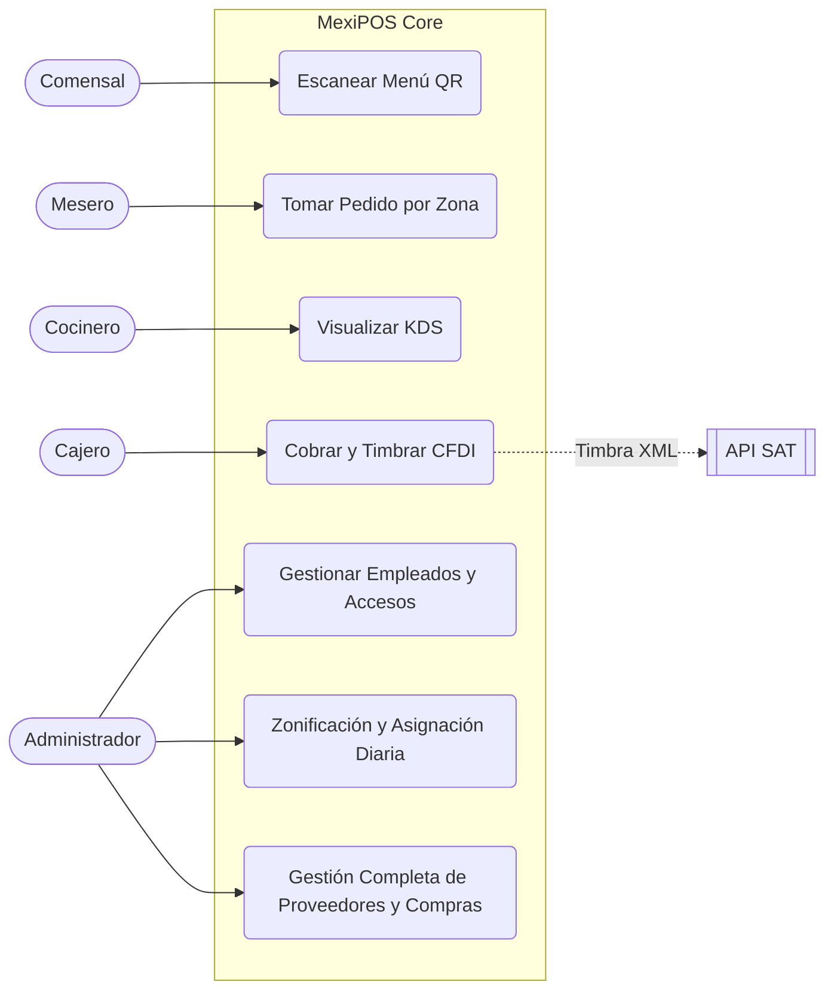
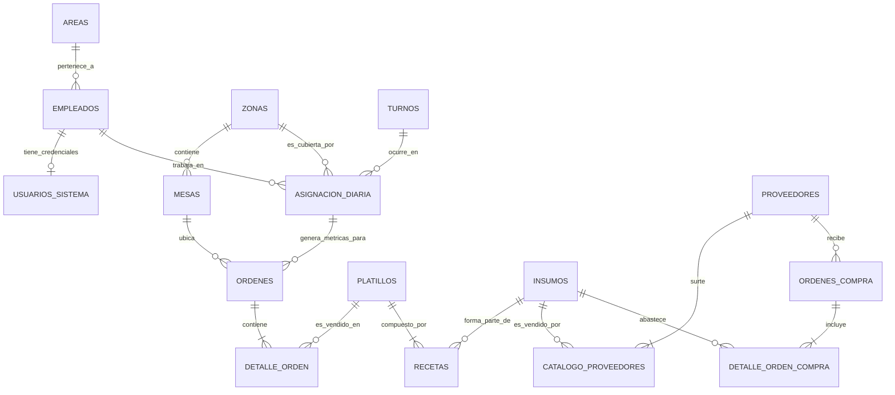

### 1. Actualización: Diagrama de Casos de Uso (Internalizado)

El Administrador ahora tiene el control total del ciclo de vida del empleado y el inventario avanzado dentro de `admin`.


---

```python
with open('Diagrama Entidad-Relación.md', 'r', encoding='utf-8') as f:
    print(f.read())


```

```text
### 1. Actualización: Diagrama de Casos de Uso (Internalizado)

El Administrador ahora tiene el control total del ciclo de vida del empleado y el inventario avanzado dentro de `admin`.



---

### 📌 Consigna F: Modelo Entidad-Relación (MER) y Diccionario de Datos

Aquí tienes la estructura de la base de datos relacional altamente normalizada, diseñada para soportar los 5 sitios (micro-frontends) y extraer la analítica de ventas y aprovisionamiento que exiges.

#### Módulo 1: Personal, Accesos y Zonificación

* **`Areas`**: Define los roles y permisos lógicos.
* `ID_Area` (PK), `Nombre` (Gerencia, Piso/Meseros, Cocina, Caja).
*   **`Empleados`**: Datos generales del personal.
*   `ID_Empleado` (PK), `Numero_Empleado` (6 a 8 dígitos), `Nombre`, `Apellidos`, `Telefono`, `ID_Area` (FK), `is_active` (Boolean - Controla Bajas Lógicas).
*   **`Usuarios_Sistema`**: Separación de credenciales. Define a qué `.sitio` pueden entrar.
*   `ID_Usuario` (PK), `ID_Empleado` (FK 1:1), `Numero_Empleado` (Unique Login ID), `Username`, `Password_Hash` (Para Admin/Caja), `PIN_Acceso` (Para Meseros), `is_active` (Boolean - Permite inhabilitar inicios de sesión mediante Baja Lógica).
* **`Turnos`**:
* `ID_Turno` (PK), `Nombre` (Matutino, Vespertino), `Hora_Inicio`, `Hora_Fin`.
* **`Zonas`**: Agrupación física del restaurante.
* `ID_Zona` (PK), `Nombre` (ej. Terraza, Salón Principal, Barra).
* **`Mesas`**:
* `ID_Mesa` (PK), `Numero`, `Capacidad`, `Estado` (Libre, Ocupada, Cuenta), `ID_Zona` (FK).
* **`Asignacion_Diaria`**: La tabla pivote/temporal para la métrica de eficiencia.
* `ID_Asignacion` (PK), `Fecha` (Date), `ID_Empleado` (FK - Mesero), `ID_Zona` (FK), `ID_Turno` (FK).

#### Módulo 2: Operación y Ventas (Comandas)

* **`Ordenes`**:
* `ID_Orden` (PK), `ID_Mesa` (FK), `ID_Empleado` (FK - Mesero que la abrió), `ID_Turno` (FK - Para reportes precisos), `Fecha_Hora_Apertura`, `Fecha_Hora_Cierre`, `Estado` (Abierta, Por_Cobrar, Pagada), `Subtotal`, `Descuento`, `IVA`, `Total`.
* **`Detalle_Orden`**:
* `ID_Detalle` (PK), `ID_Orden` (FK), `ID_Platillo` (FK), `Cantidad`, `Precio_Unitario`, `Estado_Cocina` (Pendiente, Listo).

#### Módulo 3: Menú y Recetario (Explosión)

* **`Platillos`**:
* `ID_Platillo` (PK), `Nombre`, `Precio`, `Categoria`, `Requiere_Cocina` (Boolean).
* **`Recetas`** (Tabla Pivote N:M):
* `ID_Platillo` (FK), `ID_Insumo` (FK), `Cantidad_Necesaria` (ej. 0.150 kg de carne por taco).

#### Módulo 4: Inventario y Proveedores (Aprovisionamiento Avanzado)

* **`Insumos`**:
* `ID_Insumo` (PK), `Nombre`, `Unidad_Medida` (Kg, Lts, Pza), `Stock_Actual`, `Stock_Ideal`.
* **`Proveedores`**:
* `ID_Proveedor` (PK), `Nombre_Empresa`, `Contacto`, `Dias_Promedio_Entrega`.
* **`Catalogo_Proveedores`** (Tabla Pivote N:M): Qué vende quién y a cuánto.
* `ID_Proveedor` (FK), `ID_Insumo` (FK), `Precio_Compra`, `Ultima_Actualizacion`.
* **`Ordenes_Compra`**: Cabecera de lo que se solicitó.
* `ID_Compra` (PK), `ID_Proveedor` (FK), `Fecha_Solicitud`, `Fecha_Entrega_Esperada`, `Estado` (Pendiente, Recibida_Parcial, Completada, Cancelada), `Total_Compra`.
* **`Detalle_Orden_Compra`**: Lo que llegó vs. lo que se pidió.
* `ID_Compra` (FK), `ID_Insumo` (FK), `Cantidad_Solicitada`, `Cantidad_Recibida`, `Precio_Acordado`.

---

### 📊 Diagrama Entidad-Relación (MER visual)

Este diagrama modela cómo se conectan las llaves foráneas. Al tener `Turno`, `Zona` y `Empleado` atados a la `Asignacion_Diaria` y a la `Orden`, podrás generar consultas SQL exactas para saber *"Cuántos ingresos generó el Mesero X, en la Zona Y, durante el Turno Vespertino de los viernes"*.



```
.
