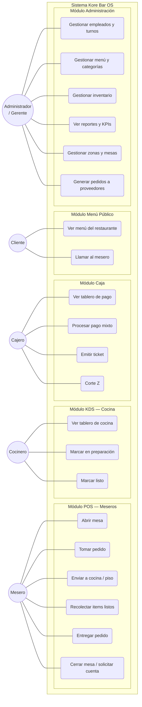

```mermaid
graph LR
    M(("Mesero"))
    CO(("Cocinero"))
    CAJ(("Cajero"))
    ADM(("Administrador\n/ Gerente"))
    CLI(("Cliente"))

    subgraph SYS["Sistema Kore Bar OS"]
        subgraph POS["Módulo POS — Meseros"]
            UC1(Abrir mesa)
            UC2(Tomar pedido)
            UC3(Enviar a cocina / piso)
            UC4(Recolectar items listos)
            UC5(Entregar pedido)
            UC6(Cerrar mesa / solicitar cuenta)
        end

        subgraph KDS["Módulo KDS — Cocina"]
            UC7(Ver tablero de cocina)
            UC8(Marcar en preparación)
            UC9(Marcar listo)
        end

        subgraph CAJA["Módulo Caja"]
            UC10(Ver tablero de pago)
            UC11(Procesar pago mixto)
            UC12(Emitir ticket)
            UC13(Corte Z)
        end

        subgraph MENU["Módulo Menú Público"]
            UC14(Ver menú del restaurante)
            UC15(Llamar al mesero)
        end

        subgraph ADMIN["Módulo Administración"]
            UC16(Gestionar empleados y turnos)
            UC17(Gestionar menú y categorías)
            UC18(Gestionar inventario)
            UC19(Ver reportes y KPIs)
            UC20(Gestionar zonas y mesas)
            UC21(Generar pedidos a proveedores)
        end
    end

    M --- UC1
    M --- UC2
    M --- UC3
    M --- UC4
    M --- UC5
    M --- UC6
    CO --- UC7
    CO --- UC8
    CO --- UC9
    CAJ --- UC10
    CAJ --- UC11
    CAJ --- UC12
    CAJ --- UC13
    CLI --- UC14
    CLI --- UC15
    ADM --- UC16
    ADM --- UC17
    ADM --- UC18
    ADM --- UC19
    ADM --- UC20
    ADM --- UC21

```