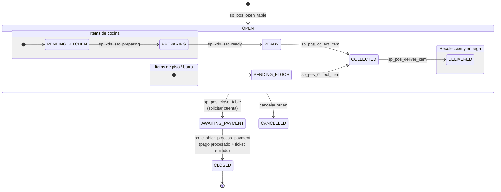

```mermaid

stateDiagram-v2
    direction TB

    [*] --> OPEN : sp_pos_open_table

    state OPEN {
        direction LR
        
        state "Items de cocina" as KDS {
            [*] --> PK
            PK : PENDING_KITCHEN
            PR : PREPARING
            RD : READY
            PK --> PR : sp_kds_set_preparing
            PR --> RD : sp_kds_set_ready
        }

        state "Items de piso / barra" as FLOOR {
            [*] --> PF
            PF : PENDING_FLOOR
        }

        state "Recolección y entrega" as COLLECT {
            CO : COLLECTED
            DV : DELIVERED
            CO --> DV : sp_pos_deliver_item
        }

        %% Conexiones entre sub-estados
        RD --> CO : sp_pos_collect_item
        PF --> CO : sp_pos_collect_item
    }

    OPEN --> AWAITING_PAYMENT : sp_pos_close_table<br/>(solicitar cuenta)
    AWAITING_PAYMENT --> CLOSED : sp_cashier_process_payment<br/>(pago procesado + ticket emitido)
    OPEN --> CANCELLED : cancelar orden
    CLOSED --> [*]

```
