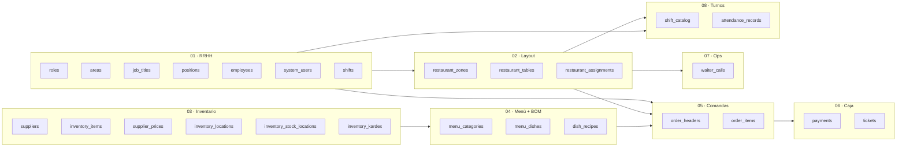
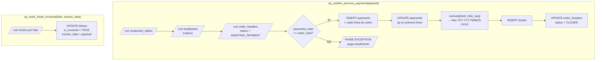
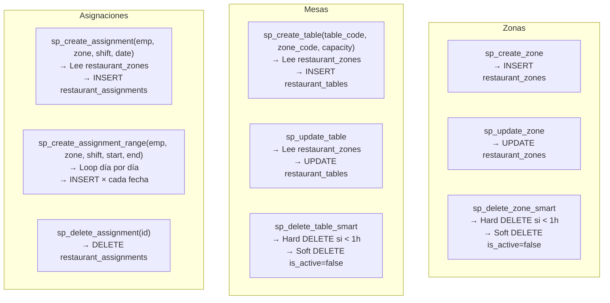
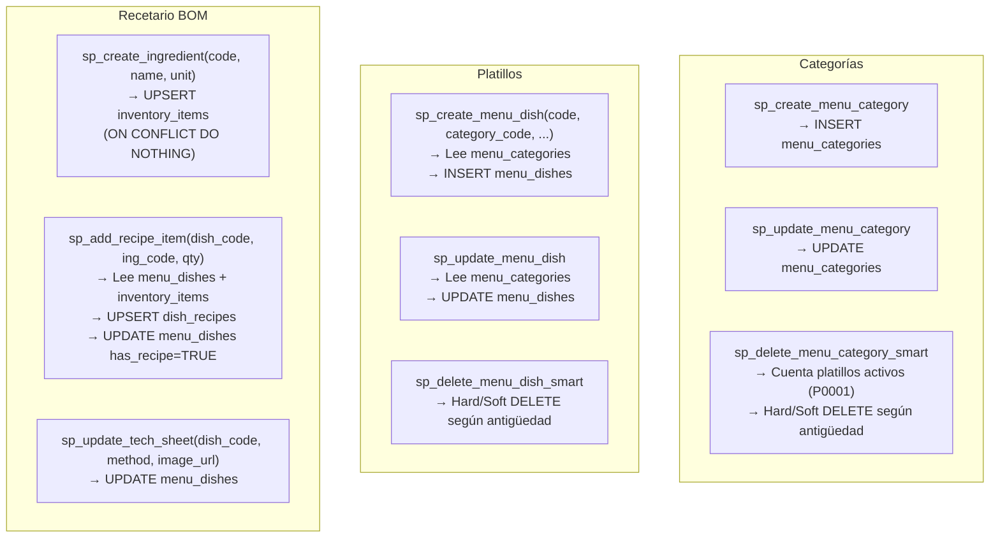
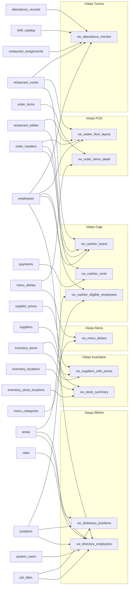

# Kore Bar OS — Documentación de Base de Datos
**Proyecto SGRM · PostgreSQL · Marzo 2026**

> Generado a partir de los archivos de migración `00_core` → `08_turnos_asistencia`,
> los procedimientos almacenados de `procedures/` y las vistas de `views/views.sql`.

---

## 1. Diagrama Entidad-Relación (ERD Completo)

> Las cardinalidades siguen la notación de Mermaid `erDiagram`.  
> Las columnas marcadas con `PK` son llaves primarias UUID.  
> Las marcadas con `UK` son llaves naturales únicas (llaves de negocio).

```mermaid
erDiagram

    %% ═══════════════════════════════════════════
    %% MÓDULO 1 — RRHH  (01_hr.sql)
    %% ═══════════════════════════════════════════

    roles {
        UUID    id          PK
        VARCHAR code        UK
        VARCHAR name
        BOOLEAN is_active
    }

    areas {
        UUID    id                  PK
        VARCHAR code                UK
        VARCHAR name
        BOOLEAN can_access_cashier
        BOOLEAN is_active
    }

    job_titles {
        UUID    id          PK
        VARCHAR code        UK
        VARCHAR name
        BOOLEAN is_active
    }

    positions {
        UUID    id              PK
        VARCHAR code            UK
        UUID    area_id         FK
        UUID    job_title_id    FK
        UUID    default_role_id FK
        BOOLEAN is_active
    }

    employees {
        UUID    id              PK
        VARCHAR employee_number UK
        VARCHAR first_name
        VARCHAR last_name
        DATE    hire_date
        UUID    position_id     FK
        VARCHAR pin_code        UK
        BOOLEAN is_active
    }

    system_users {
        UUID    id              PK
        VARCHAR employee_number UK
        VARCHAR username        UK
        VARCHAR password_hash
        UUID    role_id         FK
        BOOLEAN is_active
    }

    shifts {
        UUID        id          PK
        UUID        employee_id FK
        TIMESTAMPTZ start_time
        TIMESTAMPTZ end_time
        VARCHAR     status
    }

    areas       ||--o{ positions       : "tiene"
    job_titles  ||--o{ positions       : "clasifica"
    roles       |o--o{ positions       : "rol_default"
    positions   ||--o{ employees       : "ocupa"
    employees   ||--o{ shifts          : "tiene"
    roles       ||--o{ system_users    : "tiene_rol"


    %% ═══════════════════════════════════════════
    %% MÓDULO 2 — LAYOUT  (02_restaurant.sql)
    %% ═══════════════════════════════════════════

    restaurant_zones {
        UUID    id          PK
        VARCHAR code        UK
        VARCHAR name
        BOOLEAN is_active
    }

    restaurant_tables {
        UUID    id          PK
        VARCHAR code        UK
        UUID    zone_id     FK
        INT     capacity
        BOOLEAN is_active
    }

    restaurant_assignments {
        UUID    id              PK
        VARCHAR employee_number FK
        UUID    zone_id         FK
        VARCHAR shift
        DATE    assignment_date
    }

    restaurant_zones    ||--o{ restaurant_tables      : "contiene"
    restaurant_zones    ||--o{ restaurant_assignments : "cubre"
    employees           ||--o{ restaurant_assignments : "asignado_a"


    %% ═══════════════════════════════════════════
    %% MÓDULO 3 — INVENTARIO  (03_inventory.sql)
    %% ═══════════════════════════════════════════

    suppliers {
        UUID    id           PK
        VARCHAR code         UK
        VARCHAR name
        TEXT    contact_info
        BOOLEAN is_active
    }

    inventory_items {
        UUID    id                  PK
        VARCHAR code                UK
        VARCHAR name
        VARCHAR unit_measure
        VARCHAR recipe_unit
        DECIMAL conversion_factor
        DECIMAL current_stock
        DECIMAL minimum_stock
        BOOLEAN is_active
    }

    supplier_prices {
        UUID    id              PK
        UUID    supplier_id     FK
        UUID    item_id         FK
        DECIMAL price
        INT     lead_time_days
    }

    inventory_locations {
        UUID    id      PK
        VARCHAR code    UK
        VARCHAR name
        VARCHAR type
    }

    inventory_stock_locations {
        UUID    item_id     PK_FK
        UUID    location_id PK_FK
        DECIMAL stock
    }

    inventory_kardex {
        UUID        id                  PK
        UUID        item_id             FK
        UUID        from_location_id    FK
        UUID        to_location_id      FK
        VARCHAR     transaction_type
        DECIMAL     quantity
        VARCHAR     reference_id
        TIMESTAMPTZ date
    }

    suppliers           ||--o{ supplier_prices             : "oferta"
    inventory_items     ||--o{ supplier_prices             : "tiene_precio"
    inventory_items     ||--o{ inventory_stock_locations   : "localizado_en"
    inventory_locations ||--o{ inventory_stock_locations   : "aloja"
    inventory_items     ||--o{ inventory_kardex            : "registrado_en"
    inventory_locations |o--o{ inventory_kardex            : "origen"
    inventory_locations |o--o{ inventory_kardex            : "destino"


    %% ═══════════════════════════════════════════
    %% MÓDULO 4 — MENÚ + BOM  (04_menu.sql)
    %% ═══════════════════════════════════════════

    menu_categories {
        UUID    id          PK
        VARCHAR code        UK
        VARCHAR name
        TEXT    description
        BOOLEAN is_active
    }

    menu_dishes {
        UUID    id                  PK
        VARCHAR code                UK
        UUID    category_id         FK
        VARCHAR name
        DECIMAL price
        TEXT    image_url
        BOOLEAN is_active
        BOOLEAN has_recipe
        TEXT    preparation_method
    }

    dish_recipes {
        UUID    id                  PK
        UUID    dish_id             FK
        UUID    item_id             FK
        DECIMAL quantity_required
    }

    menu_categories ||--o{ menu_dishes   : "clasifica"
    menu_dishes     ||--o{ dish_recipes  : "compuesto_por"
    inventory_items ||--o{ dish_recipes  : "ingrediente_de"


    %% ═══════════════════════════════════════════
    %% MÓDULO 5 — COMANDAS POS  (05_orders.sql)
    %% ═══════════════════════════════════════════

    order_headers {
        UUID        id          PK
        VARCHAR     code        UK
        UUID        table_id    FK
        UUID        waiter_id   FK
        INT         diners
        VARCHAR     status
        DECIMAL     total
        TIMESTAMPTZ created_at
        TIMESTAMPTZ updated_at
    }

    order_items {
        UUID        id          PK
        UUID        order_id    FK
        UUID        dish_id     FK
        INT         quantity
        DECIMAL     unit_price
        DECIMAL     subtotal
        TEXT        notes
        VARCHAR     status
        TIMESTAMPTZ started_at
    }

    restaurant_tables   ||--o{ order_headers    : "tiene"
    employees           ||--o{ order_headers    : "atiende"
    order_headers       ||--|{ order_items      : "contiene"
    menu_dishes         ||--o{ order_items      : "vendido_en"


    %% ═══════════════════════════════════════════
    %% MÓDULO 6 — CAJA  (06_cashier.sql)
    %% ═══════════════════════════════════════════

    payments {
        UUID        id          PK
        UUID        order_id    FK
        VARCHAR     method
        DECIMAL     amount
        DECIMAL     tip
        UUID        cashier_id  FK
        TIMESTAMPTZ created_at
    }

    tickets {
        UUID    id          PK
        VARCHAR folio       UK
        UUID    order_id    FK_UK
        DECIMAL subtotal
        DECIMAL tax
        DECIMAL tip_total
        DECIMAL total
        BOOLEAN is_invoiced
        JSONB   invoice_data
    }

    order_headers   ||--o{ payments   : "cobrado_por"
    employees       ||--o{ payments   : "cajero"
    order_headers   ||--|| tickets    : "genera"


    %% ═══════════════════════════════════════════
    %% MÓDULO 7 — OPERACIONES  (07_operations.sql)
    %% ═══════════════════════════════════════════

    waiter_calls {
        UUID        id          PK
        UUID        table_id    FK
        VARCHAR     reason
        VARCHAR     status
        TIMESTAMPTZ created_at
    }

    restaurant_tables   ||--o{ waiter_calls     : "genera"


    %% ═══════════════════════════════════════════
    %% MÓDULO 8 — TURNOS Y ASISTENCIA  (08_turnos_asistencia.sql)
    %% ═══════════════════════════════════════════

    shift_catalog {
        UUID    id          PK
        VARCHAR code        UK
        VARCHAR name
        TIME    start_time
        TIME    end_time
        BOOLEAN is_active
    }

    attendance_records {
        UUID        id              PK
        VARCHAR     employee_number FK
        TIMESTAMPTZ check_in_at
        VARCHAR     source
        DATE        work_date
    }

    employees           ||--o{ attendance_records   : "registra"
    shift_catalog       |o--o{ restaurant_assignments: "define_horario"
```

---

## 2. Módulos por Capa (Visión Horizontal)



---

## 3. Stored Procedures — Qué Leen y Qué Escriben

> **Convención:** rectángulo azul = lectura · rectángulo rojo = escritura · rombo = condicional

### 3.1 `sp_inventory.sql`

```mermaid
flowchart TD
    subgraph SP_TRANSFER["sp_kardex_transfer(item_code, from_loc, to_loc, qty)"]
        T1[/"Lee inventory_items"/]
        T2[/"Lee inventory_locations × 2"/]
        T3{Stock suficiente\nen origen?}
        T4["UPDATE inventory_stock_locations\n— resta en origen"]
        T5["UPSERT inventory_stock_locations\n+ suma en destino"]
        T6["INSERT inventory_kardex\ntype = TRANSFER"]
        T_ERR[/"RAISE EXCEPTION\nstock insuficiente"/]

        T1 --> T2 --> T3
        T3 -- SÍ --> T4 --> T5 --> T6
        T3 -- NO --> T_ERR
    end

    subgraph SP_ADJUST["sp_kardex_adjustment(loc_code, item_code, physical_stock, note)"]
        A1[/"Lee inventory_locations"/]
        A2[/"Lee inventory_items"/]
        A3[/"Lee inventory_stock_locations\n(FOR UPDATE)"/]
        A4{"difference = 0?"}
        A5["INSERT inventory_kardex\ntype = ADJUSTMENT"]
        A6["UPSERT inventory_stock_locations\ncon stock físico real"]

        A1 --> A2 --> A3 --> A4
        A4 -- NO --> A5 --> A6
        A4 -- SÍ --> A_END(("RETURN"))
    end

    subgraph SP_SYNC["sp_sync_purchases(payload JSONB)"]
        S1[/"Lee inventory_locations\n(destino)"/]
        S2["UPSERT suppliers"]
        S3["UPSERT inventory_items\n(por cada ítem del payload)"]
        S4["UPSERT supplier_prices"]
        S5["INSERT inventory_kardex\ntype = IN_PURCHASE"]
        S6["UPSERT inventory_stock_locations\n+ suma en bodega destino"]

        S1 --> S2 --> S3 --> S4 --> S5 --> S6
    end

    subgraph SP_SUPP_PRICE["sp_upsert_supplier_price(supplier_code, item_code, ...)"]
        SP1[/"Lee suppliers"/]
        SP2["UPSERT inventory_items"]
        SP3["UPSERT supplier_prices"]

        SP1 --> SP2 --> SP3
    end
```



### 3.2 `sp_orders.sql`

```mermaid
flowchart TD
    subgraph SUBMIT["sp_pos_submit_order(payload)"]
        O1[/"Lee employees\n(waiter_code)"/]
        O2[/"Lee restaurant_tables"/]
        O3{Orden OPEN\nya existe?}
        O4["INSERT order_headers\nstatus = OPEN"]
        O5["Lee menu_dishes\npor cada ítem"]
        O6{"has_recipe?"}
        O7["INSERT order_items\nstatus = PENDING_KITCHEN"]
        O8["INSERT order_items\nstatus = PENDING_FLOOR"]
        O9["UPDATE order_headers\ntotal acumulado"]

        O1 --> O2 --> O3
        O3 -- NO --> O4 --> O5
        O3 -- SÍ --> O5
        O5 --> O6
        O6 -- SÍ --> O7 --> O9
        O6 -- NO --> O8 --> O9
    end

    subgraph COLLECT["sp_pos_collect_item(item_id, waiter_code)"]
        C1[/"Lee employees + order_items + menu_dishes"/]
        C2{has_recipe?}
        C3["Lee dish_recipes\ndesde LOC-COCINA"]
        C4["INSERT inventory_kardex\ntype = OUT × ingrediente"]
        C5["UPDATE inventory_stock_locations\n— stock en cocina"]
        C6["UPDATE order_items\nstatus = COLLECTED"]
        C7["Lee dish_recipes LIMIT 1\ndesde LOC-PISO"]

        C1 --> C2
        C2 -- SÍ --> C3 --> C4 --> C5 --> C6
        C2 -- NO --> C7 --> C4
    end

    subgraph OPEN_TABLE["sp_pos_open_table(table_code, employee_number, diners)"]
        OT1[/"Lee restaurant_tables"/]
        OT2[/"Lee employees"/]
        OT3{Orden OPEN\nya existe?}
        OT4["INSERT order_headers\nstatus = OPEN"]

        OT1 --> OT2 --> OT3
        OT3 -- NO --> OT4
        OT3 -- SÍ --> OT_END(("RETURN\n(idempotente)"))
    end

    subgraph CLOSE_TABLE["sp_pos_close_table(table_code, employee_number)"]
        CT1[/"Lee restaurant_tables + employees"/]
        CT2{Orden OPEN\nexiste?}
        CT3["UPDATE order_headers\nstatus = AWAITING_PAYMENT"]

        CT1 --> CT2
        CT2 -- SÍ --> CT3
        CT2 -- NO --> CT_ERR[/"RAISE EXCEPTION"/]
    end

    subgraph KDS["sp_kds_set_preparing / sp_kds_set_ready"]
        K1["UPDATE order_items\nPENDING_KITCHEN → PREPARING"]
        K2["UPDATE order_items\nPREPARING → READY"]
    end
```



### 3.3 `sp_cashier.sql`



### 3.4 `sp_hr.sql`

```mermaid
flowchart TD
    subgraph CATALOG["sp_upsert_hr_catalog(area_code, area_name, job_code, job_name)"]
        H1["UPSERT areas"]
        H2["UPSERT job_titles"]
        H3["INSERT positions\ncode = area_code + job_code\nON CONFLICT DO NOTHING"]

        H1 --> H2 --> H3
    end

    subgraph EMP["sp_upsert_employee(employee_number, ...)"]
        E1{position_id\nrequerida?}
        E2[/"Lee positions\npor code = area+job"/]
        E3{Empleado\nexiste?}
        E4["UPDATE employees\n(COALESCE: solo actualiza\nlo que venga no nulo)"]
        E5["INSERT employees"]

        E1 -- SÍ --> E2 --> E3
        E1 -- NO --> E3
        E3 -- SÍ --> E4
        E3 -- NO --> E5
    end

    subgraph DEACTIVATE["sp_deactivate_employee(employee_number)"]
        D1["UPDATE system_users\nis_active = false"]
        D2["UPDATE employees\nis_active = false"]
        D1 --> D2
    end

    subgraph RESET_PIN["sp_reset_employee_pin(employee_number, new_pin)"]
        R1["UPDATE employees\npin_code = new_pin\nWHERE is_active = true"]
        R2{NOT FOUND?}
        R_ERR[/"RAISE EXCEPTION\nP0002"/]

        R1 --> R2
        R2 -- SÍ --> R_ERR
    end
```



### 3.5 `sp_restaurant.sql`



### 3.6 `sp_menu.sql`



---

## 4. Vistas (Views) — Tablas Fuente



---

## 5. Resumen de Tablas por Módulo

| Módulo | Archivo | Tablas |
|---|---|---|
| Core | `00_core.sql` | _(solo extensiones y función `update_modified_column`)_ |
| RRHH | `01_hr.sql` | `roles`, `areas`, `job_titles`, `positions`, `employees`, `system_users`, `shifts` |
| Layout | `02_restaurant.sql` | `restaurant_zones`, `restaurant_tables`, `restaurant_assignments` |
| Inventario | `03_inventory.sql` | `suppliers`, `inventory_items`, `supplier_prices`, `inventory_locations`, `inventory_stock_locations`, `inventory_kardex` |
| Menú + BOM | `04_menu.sql` | `menu_categories`, `menu_dishes`, `dish_recipes` |
| Comandas | `05_orders.sql` | `order_headers`, `order_items` |
| Caja | `06_cashier.sql` | `payments`, `tickets`, _sequence `ticket_folio_seq`_ |
| Operaciones | `07_operations.sql` | `waiter_calls` |
| Turnos | `08_turnos_asistencia.sql` | `shift_catalog`, `attendance_records` |

## 6. Resumen de Stored Procedures

| SP | Archivo | Acción principal |
|---|---|---|
| `sp_upsert_hr_catalog` | sp_hr | UPSERT areas + job_titles + positions |
| `sp_upsert_employee` | sp_hr | UPSERT employees con resolución de position_id |
| `sp_deactivate_employee` | sp_hr | Soft DELETE employees + system_users |
| `sp_reset_employee_pin` | sp_hr → `08_turnos` | UPDATE employees.pin_code |
| `sp_create_shift` | `08_turnos` | INSERT shift_catalog |
| `sp_record_attendance` | `08_turnos` | INSERT attendance_records (idempotente) |
| `sp_create_zone` | sp_restaurant | INSERT restaurant_zones |
| `sp_delete_zone_smart` | sp_restaurant | Hard/Soft DELETE según historial + validación de mesas activas |
| `sp_create_table` | sp_restaurant | INSERT restaurant_tables (resuelve zone_id) |
| `sp_create_assignment` | sp_restaurant | INSERT restaurant_assignments (1 día) |
| `sp_create_assignment_range` | sp_restaurant | INSERT restaurant_assignments (rango de fechas) |
| `sp_delete_assignment` | sp_restaurant | DELETE restaurant_assignments |
| `sp_kardex_transfer` | sp_inventory | Partida doble: resta origen, suma destino, INSERT kardex TRANSFER |
| `sp_kardex_adjustment` | sp_inventory | Ajuste físico: calcula diferencia, INSERT kardex ADJUSTMENT |
| `sp_sync_purchases` | sp_inventory | UPSERT suppliers + items + prices + kardex IN_PURCHASE |
| `sp_upsert_supplier_price` | sp_inventory | UPSERT inventory_items + supplier_prices |
| `sp_create_supplier` | sp_inventory | INSERT suppliers |
| `sp_create_menu_category` | sp_menu | INSERT menu_categories |
| `sp_delete_menu_category_smart` | sp_menu | Valida platillos activos (P0001); Hard/Soft DELETE |
| `sp_create_menu_dish` | sp_menu | INSERT menu_dishes (resuelve category_id) |
| `sp_update_menu_dish` | sp_menu | UPDATE menu_dishes |
| `sp_delete_menu_dish_smart` | sp_menu | Hard/Soft DELETE según antigüedad |
| `sp_create_ingredient` | sp_menu | UPSERT inventory_items |
| `sp_add_recipe_item` | sp_menu | UPSERT dish_recipes + UPDATE has_recipe=TRUE |
| `sp_update_tech_sheet` | sp_menu | UPDATE menu_dishes (método + imagen) |
| `sp_pos_open_table` | sp_orders | INSERT order_headers OPEN (idempotente) |
| `sp_pos_submit_order` | sp_orders | INSERT order_items con ruteo KITCHEN/FLOOR |
| `sp_pos_collect_item` | sp_orders | OUT del kardex (cocina o piso) + COLLECTED |
| `sp_pos_close_table` | sp_orders | UPDATE order_headers → AWAITING_PAYMENT |
| `sp_pos_deliver_item` | sp_orders | UPDATE order_items → DELIVERED |
| `sp_kds_set_preparing` | sp_orders | UPDATE order_items → PREPARING |
| `sp_kds_set_ready` | sp_orders | UPDATE order_items → READY |
| `sp_cashier_process_payment` | sp_cashier | INSERT payments + INSERT tickets + CLOSED |
| `sp_mark_ticket_invoiced` | sp_cashier | UPDATE tickets.is_invoiced + invoice_data |

## 7. Resumen de Vistas

| Vista | Uso principal |
|---|---|
| `vw_directory_employees` | Directorio RRHH con área, puesto y rol |
| `vw_dictionary_positions` | Catálogo de posiciones (area + job_title) |
| `vw_menu_dishes` | Menú activo con categoría expandida |
| `vw_suppliers_with_prices` | Proveedores + precios por insumo (JSON agregado) |
| `vw_stock_summary` | Stock total por insumo + desglose por ubicación (JSON) |
| `vw_cashier_board` | Mesas en AWAITING_PAYMENT (tablero de caja) |
| `vw_cashier_corte` | Corte Z: totales cobrados por método de pago (hoy) |
| `vw_cashier_eligible_employees` | Empleados con `can_access_cashier = true` (login de caja) |
| `vw_waiter_floor_layout` | Layout de mesas con status AVAILABLE/OCCUPIED |
| `vw_order_items_detail` | Detalle de ítems de orden con nombre de platillo |
| `vw_attendance_monitor` | Cruce Roster × Checador con status PRESENTE/ESPERADO/AUSENTE |