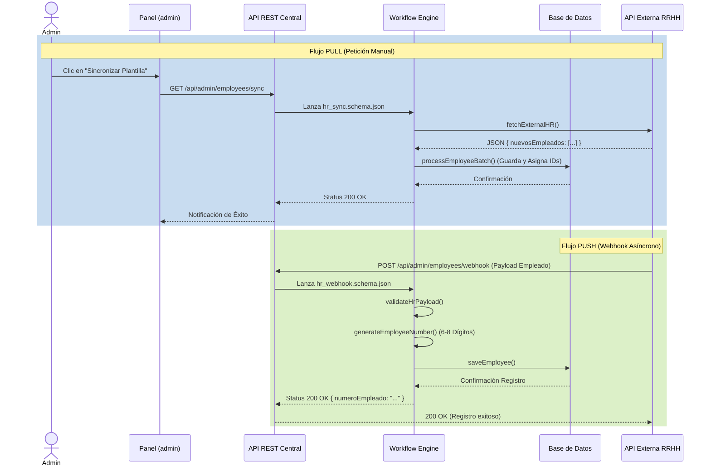
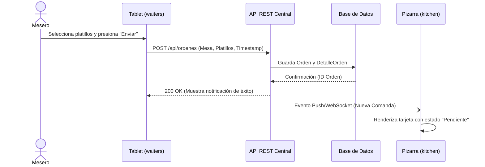
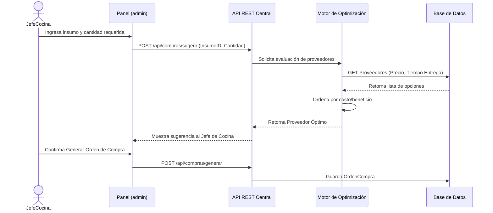
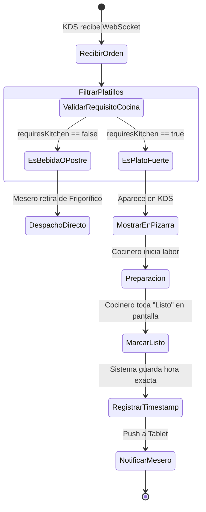
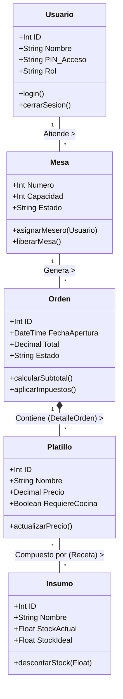

### 1. Diagrama de Casos de Uso (Interacción Actores-Sistema)

**Justificación Académica:** Define los límites del sistema y qué funcionalidades están expuestas a cada actor, garantizando que los requerimientos de la gerencia se cumplan sin mezclar responsabilidades.

flowchart LR
    %% Actores
    Comensal([Comensal])
    Mesero([Mesero])
    Cocinero([Cocinero])
    Cajero([Cajero])
    Admin([Administrador])
    SAT[[API SAT]]

    %% Sistema Centralizado
    subgraph Sistema_Restaurante [MexiPOS Core]
        UC1(Escanear Menú QR)
        UC2(Tomar Pedido por Zona)
        UC3(Visualizar KDS)
        UC4(Cobrar y Timbrar CFDI)
        
        %% Nuevos Casos Internos
        UC5(Gestionar Empleados y Accesos)
        UC6(Zonificación y Asignación Diaria)
        UC7(Gestión Completa de Proveedores y Compras)
    end

    %% Relaciones
    Comensal --> UC1
    Mesero --> UC2
    Cocinero --> UC3
    Cajero --> UC4
    Admin --> UC5
    Admin --> UC6
    Admin --> UC7
    
    UC4 -.->|Timbra XML| SAT

---

### 2. Diagramas de Secuencia (El Flujo del Tiempo y Datos)

**Justificación Académica:** Muestran el intercambio de mensajes entre los objetos del sistema a lo largo del tiempo. Son vitales para que los desarrolladores entiendan qué APIs crear y qué información viaja en cada petición (POST/GET).

#### A) Secuencia: Sincronización de Personal (RRHH)

**Contrato de Datos (Nuevas Reglas de Integración):**
El sistema espera estructuralmente que las peticiones se adhieran a un formato JSON estandarizado para dictar la operación a ejecutar:
`{ "action": "alta" | "baja", "data": { ... } }`
*   Si la acción dictada es `alta`: El flujo ejecuta un `INSERT`, creando automáticamente un número de empleado de 6-8 dígitos y asignando accesos.
*   Si la acción dictada es `baja`: El flujo ejecuta un `UPDATE`, asignando `is_active = false` (Baja Lógica) sobre los registros relacionales para revocar credenciales conservando el historial transaccional del empleado.



#### B) Secuencia: Registro de Pedido (Mesero a Cocina)



#### B) Secuencia: Aprovisionamiento Inteligente



---

### 3. Diagrama de Actividad (Proceso de Cocina)

**Justificación Académica:** Modela la lógica condicional y los flujos de trabajo internos de un proceso complejo. En la cocina, es crucial definir qué pasa con los productos de almacén vs. los de preparación.



---

### 4. Diagrama de Clases (Arquitectura Orientada a Objetos)

**Justificación Académica:** Es el "plano de construcción" para los programadores del backend. Define las entidades de software, sus atributos y los métodos que las operan antes de convertirse en tablas de bases de datos.



---

### 5. Diagrama de Componentes (Arquitectura Física y Lógica)

**Justificación Académica:** Muestra cómo los micro-frontends (que diseñamos en HTML) se empaquetan y comunian a través de la red de área local (LAN) a 200 Mbps con el servidor central, justificando las inversiones en hardware y topología de red.

```mermaid
flowchart TD
    subgraph Red_LAN_Inalambrica [Red Local Restaurante (Wi-Fi 200 Mbps)]
        
        subgraph Capa_Presentacion [Micro-Frontends (SPA)]
            M_App[waiters<br/>(Tablet App)]
            C_App[kitchen<br/>(KDS Pizarra)]
            A_App[admin<br/>(PC Gerencia)]
            Caja_App[cashier<br/>(PC Cobro)]
        end

        subgraph Capa_Logica [Servidor Central]
            API[API REST Core<br/>(Node.js / Python)]
            WS[Servidor WebSocket<br/>(Eventos KDS)]
        end

        subgraph Capa_Datos [Persistencia]
            DB[(Base de Datos<br/>Relacional)]
        end
        
        %% Conexiones Internas
        M_App <-->|HTTP/JSON| API
        A_App <-->|HTTP/JSON| API
        Caja_App <-->|HTTP/JSON| API
        
        M_App -.->|Suscripción| WS
        C_App <-->|WebSockets| WS
        WS <--> API
        
        API <-->|SQL| DB
    end

    %% Componentes Externos
    Comensal(Dispositivo Móvil Comensal) -->|HTTP GET| API
    Caja_App -->|Petición Timbrado| SAT((API SAT PAC))
    A_App -->|Importar IDs| RRHH((Sistema RRHH))

```

