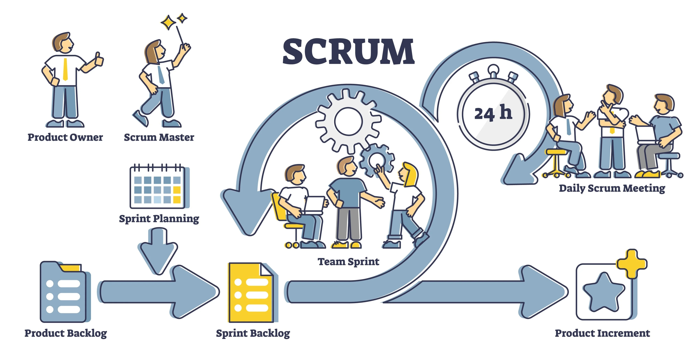

# Justificación Metodológica y Tecnológica: Implementación de Scrum y Jira

**Proyecto:** Sistema de Gestión para Restaurante Mexicano
**Autor:** Alberto Martínez

---

## 1. Introducción

El desarrollo de un sistema de gestión de restaurante —que integra módulos de administración, punto de venta móvil, Kitchen Display System (KDS) e inventarios automatizados— representa un desafío de ingeniería de software que requiere alta adaptabilidad, control estricto de presupuesto (tope de $200,000 MXN) y entregas funcionales iterativas. Para garantizar el éxito de este proyecto, se ha determinado el uso del marco de trabajo **Scrum** gestionado a través de la plataforma **Jira**. El presente documento expone los fundamentos teóricos, orígenes y ventajas comparativas que sustentan esta decisión arquitectónica y de gestión.

---

## 2. Metodología de Desarrollo: Scrum

### 2.1. ¿Qué es Scrum y de dónde surge?

Scrum es un marco de trabajo (*framework*) ágil diseñado para abordar problemas complejos adaptativos, permitiendo la entrega de productos de máximo valor de forma productiva y creativa.

**Origen:** Sus raíces teóricas se remontan a 1986, cuando Hirotaka Takeuchi y Ikujiro Nonaka publicaron el artículo *"The New New Product Development Game"* en la Harvard Business Review, comparando el desarrollo de alta iteración con el avance en bloque de la formación "Scrum" en el rugby. Posteriormente, a principios de la década de 1990, Ken Schwaber y Jeff Sutherland formalizaron el marco de trabajo para la industria del software, presentándolo oficialmente en la conferencia OOPSLA en 1995.

### 2.2. Justificación de Scrum para el Proyecto del Restaurante

Para este proyecto, la adopción de Scrum se justifica por las siguientes razones:

1. **Entregas Incrementales (Sprints):** Al dividir el proyecto en 4 Sprints, el gerente del restaurante no tiene que esperar al final del desarrollo para ver resultados. Al término del Sprint 2, ya puede interactuar con el prototipo y la configuración de mesas.
2. **Mitigación de Riesgos Financieros:** Con un presupuesto fijo de $200,000 MXN, Scrum permite priorizar el *Backlog* por valor de negocio. Si el presupuesto se agota, el restaurante se queda con un software funcional de los módulos más críticos, en lugar de un sistema a medias.
3. **Adaptabilidad frente a la Operación Real:** Los requerimientos en el sector gastronómico cambian rápidamente (ej. nuevos flujos de facturación CFDI o cambios en la operación de cocina). Scrum permite la inspección y adaptación constante en cada *Sprint Review*.

### 2.3. Scrum vs. Metodologías Tradicionales (Cascada)

* **Frente al modelo en Cascada (Waterfall):** El modelo tradicional asume que todos los requerimientos pueden ser previstos desde el día uno y documentados exhaustivamente antes de programar. En este sistema de restaurante, si los cocineros detectan que la pizarra interactiva del KDS no se ajusta a sus guantes o tiempos en la fase final, en Cascada el rediseño sería catastrófico en costos. Scrum, mediante iteraciones cortas, permite pivotar la UI del KDS en etapas tempranas.
* **Frente a Kanban puro:** Aunque Kanban es excelente para flujos continuos, carece de las "cajas de tiempo" rígidas (Sprints) que Scrum ofrece. Para un proyecto acotado en tiempo y presupuesto, los Sprints obligan a compromisos medibles cada dos semanas.

---

## 3. Herramienta de Gestión: Jira

### 3.1. ¿Qué es Jira y de dónde surge?

Jira es una plataforma de gestión de proyectos y seguimiento de incidencias (*issue tracking*) desarrollada por la empresa australiana **Atlassian**.

**Origen:** Lanzada en el año 2002, su nombre proviene de "Gojira" (el nombre japonés de Godzilla), ya que inicialmente fue concebida como un competidor directo del sistema de seguimiento de errores "Bugzilla". Con la evolución del Manifiesto Ágil, Jira Software se transformó en la herramienta de estándar industrial para la gestión de ciclos de vida de desarrollo de software (SDLC) bajo marcos como Scrum y Kanban.

### 3.2. Justificación de Jira para el Proyecto del Restaurante

La selección de Jira no es arbitraria; responde a la necesidad de mantener trazabilidad desde la concepción del requerimiento hasta la puesta en producción:

1. **Arquitectura Nativa para Scrum:** Jira entiende orgánicamente la jerarquía que hemos diseñado: *Épicas* (ej. EP-03 Cocina) -> *Historias de Usuario* (ej. HU-15 Visualizar pedidos) -> *Subtareas*.
2. **Trazabilidad y Métricas:** Permite generar gráficos de trabajo pendiente (*Burndown charts*) y medir la velocidad del equipo, factores cruciales para asegurar que los entregables se mantendrán dentro del cronograma proyectado de 8 semanas.
3. **Integración Tecnológica:** Al tratarse de un ecosistema moderno, permite integración directa con repositorios de código (GitHub/Bitbucket) para rastrear qué bloque de código (commits) soluciona qué Historia de Usuario.

### 3.3. Jira vs. Otras Plataformas del Mercado

* **Jira vs. Trello:** Aunque Trello (también de Atlassian) es visualmente intuitivo, está basado puramente en tableros Kanban simples. Carece de la jerarquía de Épicas, control avanzado de *Story Points*, reportaría ágil nativa y flujos de trabajo personalizados que exige un software de la magnitud de este sistema de restaurante.
* **Jira vs. Asana / Monday.com:** Asana y Monday son excelentes para gestión de proyectos generales o equipos de marketing. Sin embargo, no están diseñados con el vocabulario ni la estructura nativa del desarrollo de software. Jira está creado *por* y *para* equipos de ingeniería.
* **Jira vs. Azure DevOps:** Azure DevOps es una suite robusta y altamente competitiva, pero su curva de aprendizaje es más pronunciada y suele ser ideal para ecosistemas estrictamente centrados en Microsoft (.NET, Azure). Jira, por su parte, ofrece mayor neutralidad e integraciones con cualquier *stack* tecnológico que se decida usar en este proyecto.

---

## 4. Conclusión

La sinergia entre **Scrum** y **Jira** proporciona el equilibrio perfecto entre rigor metodológico y flexibilidad operativa. Mientras Scrum dicta el "cómo" pensamos, iteramos y nos adaptamos a las necesidades del restaurante, Jira proporciona la infraestructura digital para ejecutar, medir y auditar el desarrollo. Esta combinación es la garantía académica y profesional de que el sistema se entregará con la máxima calidad, alineado al presupuesto y a las expectativas del cliente.
