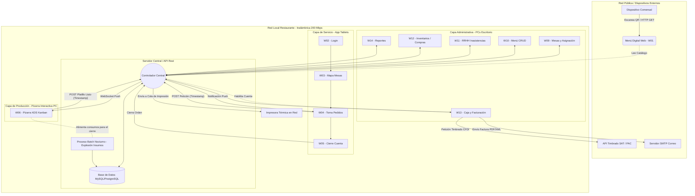

# Diagrama de Integración y Arquitectura de Solución

## Justificación del Modelo
El siguiente diagrama ilustra la topología de la red local (LAN) a 200 Mbps requerida para la operación, y cómo los distintos módulos de interfaces interactúan con el backend centralizado. Esta arquitectura garantiza que los nodos de operación (Tabletas y KDS) funcionen de manera asíncrona pero sincronizada con la base de datos central, asegurando la consistencia de los datos desde la toma de pedido hasta la facturación.

* **Flujo Transaccional Crítico:** La tableta (W04) envía la petición a la API. La API guarda en DB e informa a la Pizarra KDS (W06). Al terminar, KDS avisa a la API, quien notifica a la tableta. Al cerrar la cuenta (W05), se libera la mesa y la información pasa directamente al módulo de Caja (W13) para pago o facturación conectándose al SAT. Al final del día, los pedidos cerrados ejecutan el script de consumo de inventarios.
